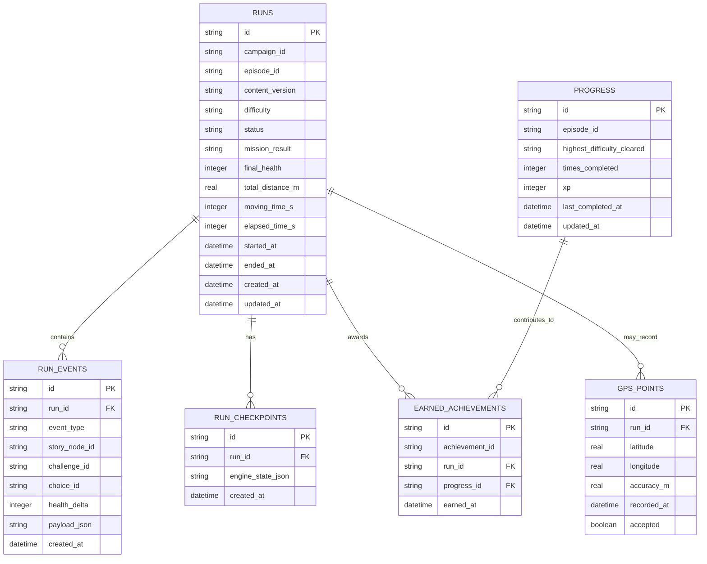

# Pursuit — Database Design

**Status:** Initial local SQLite design for the MVP  
**Scope:** On-device persistence for runs, recovery, progression, and achievements  
**Related:** [Game Mechanics & Product Design](./game-mechanics.md) · [Feature Set & MVP Requirements](./features.md) · [Use Cases & User Flows](./use-cases-and-user-flows.md) · [Technical Stack & System Architecture](./tech-stack-and-architecture.md) · [Game Engine Design](./game-engine.md)

## 1. Purpose

Pursuit does not need a cloud database for the MVP. All player data can be stored locally on the phone using SQLite.

The database exists to persist:

- Completed and interrupted runs.
- Important events that happened during a run.
- Game-engine checkpoints for crash/restart recovery.
- Long-term episode progress.
- Achievements earned by the player.
- Optional GPS samples if we decide they are necessary.

The database should **not** store the authored game content itself unless a future feature requires it.

Campaigns, episodes, story nodes, challenge definitions, and audio references should remain bundled application content, for example:

```text
content/
└── forest/
    └── episode-1.json
```

A useful separation is:

```text
JSON files  = what the game is
SQLite      = what the player did
```

## 2. Core design

The `runs` table is the central record.

A single run can have:

- Many run events.
- Many saved checkpoints.
- Zero or many earned achievements.
- Zero or many GPS points, if detailed route storage is enabled.

Player progression is stored separately because it represents long-term state across many runs.

## 3. ER diagram



## 4. Table: runs

The `runs` table stores one row for each physical running session.

Suggested fields:

| Field | Type | Purpose |
| --- | --- | --- |
| `id` | TEXT PK | Stable UUID for the run |
| `campaign_id` | TEXT | Campaign identifier, e.g. `forest` |
| `episode_id` | TEXT | Episode identifier |
| `content_version` | TEXT | Version of the episode content used |
| `difficulty` | TEXT | `easy`, `medium`, or `hard` |
| `status` | TEXT | Session status such as `in_progress`, `completed`, `ended_early` |
| `mission_result` | TEXT | `cleared`, `failed`, `incomplete`, or null while active |
| `final_health` | INTEGER | Health at mission end |
| `total_distance_m` | REAL | Final recorded distance |
| `moving_time_s` | INTEGER | Total moving time |
| `elapsed_time_s` | INTEGER | Total elapsed time |
| `started_at` | DATETIME | Run start time |
| `ended_at` | DATETIME nullable | Run end time |
| `created_at` | DATETIME | Record creation time |
| `updated_at` | DATETIME | Last update time |

### Example

```text
id:                  89c1...
campaign_id:         forest
episode_id:          first_escape
content_version:     1
difficulty:          hard
status:              completed
mission_result:      cleared
final_health:        1
total_distance_m:    4821.4
moving_time_s:       1640
elapsed_time_s:      1785
```

A mission can fail while the physical run continues, so `status` and `mission_result` should remain separate concepts.

## 5. Table: run_events

`run_events` records meaningful things that happened during a run.

Examples:

- Story node activated.
- Player chose Gate.
- Challenge started.
- Challenge passed.
- Challenge failed.
- Health changed.
- Mission failed.
- Mission completed.

Suggested fields:

| Field | Type | Purpose |
| --- | --- | --- |
| `id` | TEXT PK | Stable event identifier |
| `run_id` | TEXT FK | Parent run |
| `event_type` | TEXT | Event category |
| `story_node_id` | TEXT nullable | Related story node |
| `challenge_id` | TEXT nullable | Related challenge |
| `choice_id` | TEXT nullable | Related player choice |
| `health_delta` | INTEGER nullable | Health change, e.g. `-1` |
| `payload_json` | TEXT nullable | Extra structured details when needed |
| `created_at` | DATETIME | Event time |

Example:

```text
event_type:       CHOICE_CONFIRMED
story_node_id:    gate_choice
choice_id:        gate
```

Another:

```text
event_type:       CHALLENGE_FAILED
challenge_id:     closing_gate
health_delta:     -1
```

### Why keep an event table?

It gives us useful history without having to infer everything from the final run row.

It can support:

- Results screens.
- Debugging.
- Achievement evaluation.
- Replaying what happened during a run.
- Future analytics.

Do not log every tiny GPS update as a `run_event`.

## 6. Table: run_checkpoints

Checkpoints exist for recovery if the app crashes, is terminated, or otherwise stops mid-run.

The engine already has a serializable `GameState`. For the MVP, storing that state as JSON is simpler than creating a database column/table for every temporary engine field.

Suggested fields:

| Field | Type | Purpose |
| --- | --- | --- |
| `id` | TEXT PK | Checkpoint identifier |
| `run_id` | TEXT FK | Parent run |
| `engine_state_json` | TEXT | Serialized game-engine state |
| `created_at` | DATETIME | Checkpoint time |

Example:

```json
{
  "campaignId": "forest",
  "episodeId": "first_escape",
  "contentVersion": "1",
  "difficulty": "hard",
  "status": "challenge",
  "currentStoryNodeId": "gate_challenge",
  "visitedStoryNodeIds": [
    "intro",
    "first_encounter",
    "gate_choice",
    "gate_challenge"
  ],
  "health": 2,
  "totalDistanceMeters": 2410,
  "movingTimeSeconds": 820,
  "elapsedTimeSeconds": 900,
  "activeChallenge": {
    "challengeId": "closing_gate",
    "status": "active",
    "distanceAtStartMeters": 2280,
    "elapsedAtStartSeconds": 852,
    "challengeDistanceMeters": 130,
    "challengeElapsedSeconds": 48
  }
}
```

Checkpoint after major transitions such as:

- Episode start.
- Story transition.
- Confirmed choice.
- Challenge start.
- Challenge pass/fail.
- Health change.
- Pause.
- Mission completion/failure.

Periodic checkpoints may also be useful, but the exact frequency should balance recovery quality with unnecessary writes.

## 7. Table: progress

`progress` stores long-term player state across multiple runs.

For the MVP, one row per episode is probably enough.

Suggested fields:

| Field | Type | Purpose |
| --- | --- | --- |
| `id` | TEXT PK | Progress record ID |
| `episode_id` | TEXT UNIQUE | Episode tracked |
| `highest_difficulty_cleared` | TEXT nullable | Best recognized clear |
| `times_completed` | INTEGER | Successful clears |
| `xp` | INTEGER | Local progression value |
| `last_completed_at` | DATETIME nullable | Last successful clear |
| `updated_at` | DATETIME | Last update |

Example:

```text
episode_id:                 first_escape
highest_difficulty_cleared: hard
times_completed:            4
xp:                         850
```

If progression later becomes campaign-wide or account-wide, this schema can evolve.

## 8. Table: earned_achievements

This table stores achievements actually earned by the local player.

Suggested fields:

| Field | Type | Purpose |
| --- | --- | --- |
| `id` | TEXT PK | Earned-achievement record |
| `achievement_id` | TEXT | Bundled achievement definition ID |
| `run_id` | TEXT FK nullable | Run that earned it |
| `progress_id` | TEXT FK nullable | Related long-term progress |
| `earned_at` | DATETIME | First earned time |

The achievement definition itself should stay in game content, not the database.

For example:

```json
{
  "id": "hard_escape",
  "name": "Hard Escape",
  "description": "Clear The Forest: First Escape on Hard."
}
```

SQLite only needs to store that `hard_escape` was earned and when.

A uniqueness constraint such as:

```text
UNIQUE(achievement_id)
```

may be appropriate if achievements are one-time unlocks.

If some accomplishments can be earned repeatedly, use a different design for those.

## 9. Optional table: gps_points

Detailed GPS storage is **not automatically required** for the MVP.

Possible fields:

| Field | Type | Purpose |
| --- | --- | --- |
| `id` | TEXT PK | GPS sample ID |
| `run_id` | TEXT FK | Parent run |
| `latitude` | REAL | Latitude |
| `longitude` | REAL | Longitude |
| `accuracy_m` | REAL | Reported GPS accuracy |
| `recorded_at` | DATETIME | Sample time |
| `accepted` | BOOLEAN | Whether the location pipeline considered it valid |

### Reasons to store GPS points

- Show a route map later.
- Diagnose GPS bugs.
- Recalculate certain run metrics.
- Validate field-test behavior.

### Reasons not to store them

- Exact location history is sensitive.
- It creates much more data than other tables.
- The MVP does not require a route map.
- Most gameplay only needs processed distance/time values.

### Recommended MVP approach

Start without permanent raw GPS history unless the technical prototype shows a strong need for it.

During development, we may temporarily support debug GPS logging. Before release, decide exactly:

- Whether raw points need to be retained.
- How long to keep them.
- How the player deletes them.
- Whether route data should ever appear in sharing.

Default results sharing must **not** expose exact route coordinates.

## 10. What belongs in JSON vs SQLite

### Bundled JSON / assets

Store definitions such as:

- Campaigns.
- Episodes.
- Story nodes.
- Decisions.
- Challenges.
- Difficulty requirements.
- Achievement definitions.
- Audio IDs and metadata.

Example:

```text
content/
└── forest/
    ├── campaign.json
    ├── episode-1.json
    ├── challenges.json
    └── achievements.json
```

### SQLite

Store player-specific information:

- Runs.
- Run outcomes.
- Decisions the player actually made.
- Challenges actually attempted.
- Engine recovery checkpoints.
- Progress.
- Earned achievements.
- Optional GPS samples.

This prevents authored content from being duplicated into every player's database.

## 11. Suggested keys and IDs

Use UUID-style string IDs for runtime/player records:

- `runs.id`
- `run_events.id`
- `run_checkpoints.id`
- `earned_achievements.id`
- `gps_points.id`

Use stable human-readable IDs for authored content:

- `forest`
- `first_escape`
- `gate_choice`
- `closing_gate`
- `hard_escape`

This gives us readable content files while avoiding collisions between user-generated records.

## 12. Foreign-key behavior

Suggested relationships:

```text
runs
 ├── 1 : many run_events
 ├── 1 : many run_checkpoints
 ├── 1 : many earned_achievements
 └── 1 : many gps_points (optional)

progress
 └── 1 : many earned_achievements (optional association)
```

Use SQLite foreign keys.

If a run is intentionally deleted, associated child records should generally be deleted as well.

Conceptually:

```text
ON DELETE CASCADE
```

for `run_events`, `run_checkpoints`, and `gps_points`.

Achievement deletion behavior needs care: if an achievement is intended as permanent progression, deleting a historical run should not necessarily remove the achievement. This should be finalized when we define history deletion behavior.

## 13. Indexes

The MVP does not need complicated indexing.

Likely useful indexes:

```text
runs(started_at)
runs(episode_id)
run_events(run_id, created_at)
run_checkpoints(run_id, created_at)
earned_achievements(achievement_id)
gps_points(run_id, recorded_at)   -- only if table exists
```

These support common history/recovery queries.

## 14. Example save flow

During a run:

```text
Player starts episode
        ↓
INSERT runs
        ↓
Engine reaches story event
        ↓
INSERT run_events
        ↓
Important state change
        ↓
INSERT run_checkpoints
        ↓
Challenge fails
        ↓
INSERT run_events
UPDATE runs if required
        ↓
Mission eventually completes
        ↓
UPDATE runs final statistics/result
UPDATE progress
INSERT earned_achievements
```

The engine itself should not run these SQL statements.

The session/application layer receives engine outputs and calls repository functions such as:

```ts
runRepository.createRun(...)
eventRepository.addEvent(...)
checkpointRepository.save(...)
progressRepository.update(...)
achievementRepository.unlock(...)
```

## 15. Example recovery flow

```text
App restarts
     ↓
Find latest run WHERE status = "in_progress"
     ↓
Load latest run_checkpoint
     ↓
Deserialize engine_state_json
     ↓
Restore game engine
     ↓
Recheck GPS / permissions / audio
     ↓
Offer safe resume or end
```

Do not fabricate distance, time, choices, or challenge results for any unrecorded gap.

## 16. Schema versioning and migrations

Even though SQLite is local, schema changes should still be versioned.

For example:

```text
001_initial.sql
002_add_achievements.sql
003_add_content_version.sql
```

Expo/SQLite implementation details can be chosen when development begins.

The important principle is:

> Never assume every installed app has the newest database shape.

Future app updates should migrate existing local data rather than silently recreating the database.

## 17. Privacy and retention

Pursuit may process sensitive location information.

MVP principles:

- Keep player data local by default.
- Store only information needed for the game.
- Do not require an account.
- Do not transmit run data to a backend because there is no backend in the MVP.
- Do not expose raw coordinates in shared result cards.
- Make deletion behavior explicit before release.
- Reconsider whether raw GPS points need persistent storage at all.

## 18. Initial MVP schema recommendation

Start implementation with these tables:

```text
runs
run_events
run_checkpoints
progress
earned_achievements
```

Treat `gps_points` as optional until the GPS prototype proves we need persistent route data.

That means the MVP database can remain small and focused.

## 19. Open design questions

These should be answered during implementation/playtesting rather than guessed now:

- Do we need permanent raw GPS samples or only processed run totals?
- How frequently should active runs be checkpointed?
- Should old checkpoints be pruned after successful completion?
- Should achievements be permanently retained if the run that earned them is deleted?
- Does XP belong per episode, per campaign, or globally?
- What exact migration mechanism will be used with Expo SQLite?
- What player-facing history deletion controls are needed before release?

## 20. Recommended first database implementation slice

1. Create the `runs` table.
2. Create one active run record.
3. Update its distance/time values.
4. Create `run_checkpoints`.
5. Serialize and restore a sample `GameState`.
6. Add `run_events`.
7. Complete the run and persist final result.
8. Add `progress`.
9. Add `earned_achievements`.
10. Only add permanent `gps_points` if a demonstrated product/debugging need remains.

The first database milestone is successful when an interrupted miniature game-engine test can restore from SQLite and finish with a correct local run result.
