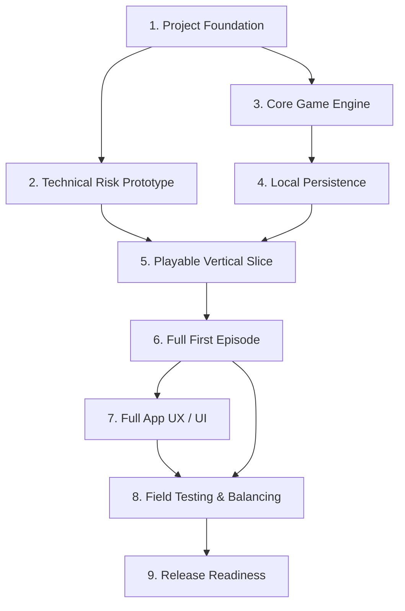

# Pursuit — Development Roadmap

**Status:** Initial implementation roadmap for the MVP  
**Scope:** From project setup through a complete, testable version of *The Forest: First Escape*  
**Related:** [Game Mechanics & Product Design](./game-mechanics.md) · [Feature Set & MVP Requirements](./features.md) · [Use Cases & User Flows](./use-cases-and-user-flows.md) · [Technical Stack & System Architecture](./tech-stack-and-architecture.md) · [Game Engine Design](./game-engine.md) · [Database Design](./database-design.md) · [UX/UI Design](./ux-ui.md)

## 1. Roadmap philosophy

Pursuit should be built in risk-reducing milestones.

The biggest technical unknowns are not ordinary screens or navigation. They are:

- reliable outdoor GPS tracking
- background / locked-screen behavior
- audio playback during a run
- short voice-command recognition while moving
- interruption and recovery
- local persistence
- fair challenge evaluation using real-world movement

Because of that, development should prove the risky mobile capabilities **before** investing heavily in polished campaign screens or complete story content.

The roadmap order is:

```text
Foundation
   ↓
Technical Risk Prototype
   ↓
Core Game Engine
   ↓
Local Persistence
   ↓
Playable Vertical Slice
   ↓
Full First Episode
   ↓
Full App UX / Polish
   ↓
Field Testing & Balancing
   ↓
Release Readiness
```

Each milestone should produce something demonstrably useful and testable.

---

# Milestone 1 — Project Foundation

## Goal

Create a working React Native / Expo application with the basic development structure needed for all later work.

## Scope

- Initialize React Native with Expo.
- Use TypeScript.
- Configure Expo Router.
- Establish basic project folder structure.
- Set up linting and formatting.
- Set up automated TypeScript tests.
- Install and initialize SQLite.
- Add basic Home / Play / Profile navigation.
- Create a development build.
- Run the app on at least one real physical phone.

## Suggested tasks

- Initialize Expo project.
- Configure TypeScript.
- Configure Expo Router.
- Create `app/`, `engine/`, `services/`, `database/`, `content/`, and `assets/`.
- Add bottom navigation shell.
- Add placeholder Home, Play, and Profile screens.
- Add SQLite initialization.
- Add unit-test infrastructure.
- Add basic logging/error utility.
- Create Android/iOS development build configuration as appropriate.

## Dependencies

None.

## Acceptance criteria

- The app launches successfully on a real mobile device.
- Home / Play / Profile navigation works.
- A simple local SQLite write/read test succeeds.
- Unit tests can be run locally.
- A development build can be installed without depending entirely on Expo Go.

## Out of scope

- Full campaign UI.
- Real GPS tracking.
- Real voice recognition.
- Game-engine logic.
- Final visual styling.
- Cloud services.

---

# Milestone 2 — Technical Risk Prototype

## Goal

Prove that the core mobile hardware and operating-system integrations are viable before building the full game.

This is the most important technical validation milestone.

## 2.1 GPS prototype

### Tasks

- Request foreground and required background location permissions.
- Start and stop an outdoor run.
- Receive GPS samples.
- Record reported GPS accuracy.
- Calculate cumulative route distance.
- Calculate basic live / average pace.
- Track elapsed and moving time.
- Test locking the phone while recording.
- Test pause and resume.
- Detect obviously invalid GPS jumps.
- Log enough information for field debugging.

### Acceptance criteria

- A real outdoor run records plausible cumulative distance.
- A loop returns to the starting area while still increasing total distance.
- Locking the phone does not immediately destroy the session under supported device conditions.
- Invalid GPS jumps do not create obviously fake distance.
- Temporary bad GPS does not automatically produce a failure condition.

## 2.2 Audio prototype

### Tasks

- Play one bundled narration clip.
- Play audio during an active GPS session.
- Test with phone speaker.
- Test with wired/Bluetooth headphones where available.
- Test screen-locked behavior.
- Test pause/resume of playback.
- Test common interruptions such as switching apps or an incoming audio interruption where possible.

### Acceptance criteria

- Bundled audio plays reliably during a tracked run.
- Audio does not require an internet connection.
- Common interruptions do not corrupt the run state.

## 2.3 Voice-command prototype

### Tasks

- Evaluate a React Native-compatible speech-recognition approach.
- Prefer on-device/offline recognition where feasible.
- Recognize a tiny command vocabulary such as:
  - Gate
  - Detour
- Only listen during an explicit short decision window.
- Add recognition confirmation.
- Add retry behavior.
- Add predetermined safer fallback.
- Test while stationary.
- Test outdoors while jogging.
- Test while breathing heavily.
- Test with different microphones/headphones where practical.

### Acceptance criteria

- A short command can be recognized in a realistic outdoor test.
- Unrecognized input never triggers a hazardous choice.
- Retry and safer fallback behavior works.
- Voice can be disabled/unavailable without making the app unsafe.

## 2.4 SQLite recovery prototype

### Tasks

- Create a basic active-run record.
- Save a small checkpoint.
- Force-close or interrupt the app.
- Reopen the app.
- Detect the in-progress run.
- Restore the saved state.

### Acceptance criteria

- The app can recover a known saved checkpoint after interruption.
- It never invents missing distance or events from the interruption gap.

## Milestone 2 overall acceptance criteria

A real-device prototype can:

1. start a run;
2. collect plausible outdoor movement;
3. continue under basic screen-lock conditions;
4. play bundled audio;
5. accept one short voice decision or safer fallback;
6. save state locally;
7. restore after interruption.

If one of these capabilities proves unreliable, adjust architecture here before building the full game.

## Out of scope

- Full episode story.
- Polished map.
- Full campaign UI.
- Achievements.
- Complete engine.
- Final difficulty balancing.

---

# Milestone 3 — Core Game Engine

## Goal

Implement and test the pure TypeScript gameplay engine independently from React Native and device hardware.

## Scope

Implement the minimal state/event system described in [game-engine.md](./game-engine.md).

## Suggested tasks

- Define `GameState`.
- Define `GameEvent`.
- Define `EngineOutput`.
- Define `StoryNode`.
- Define `DecisionDefinition`.
- Define `ChallengeDefinition`.
- Implement `ready → running`.
- Implement cumulative-distance story checkpoints.
- Implement explicit decisions.
- Implement one distance/time challenge.
- Implement success and failure transitions.
- Implement health changes.
- Implement mission failure.
- Implement mission completion.
- Implement pause/resume.
- Implement serializable engine state.
- Load a miniature episode definition from bundled JSON.
- Add unit and flow tests.

## Dependencies

Milestone 1.

Milestone 2 informs the shape of real-world movement and voice events but the engine itself should remain hardware-independent.

## Acceptance criteria

A full miniature mission can be simulated on a laptop using automated tests:

```text
start
→ run to checkpoint
→ make decision
→ begin challenge
→ pass or fail
→ update health
→ continue
→ finish mission
```

The same initial state + episode data + event sequence must produce the same result.

## Out of scope

- Actual Expo Location calls.
- Actual microphone/audio calls.
- SQL queries from the engine.
- Full first-episode content.

---

# Milestone 4 — Local Persistence Integration

## Goal

Connect the engine/session system to SQLite and support safe persistence throughout a run.

## Scope

Implement the MVP schema from [database-design.md](./database-design.md):

- `runs`
- `run_events`
- `run_checkpoints`
- `progress`
- `earned_achievements`

Keep `gps_points` optional until the GPS prototype proves a permanent need.

## Suggested tasks

- Create schema migration system.
- Create `runs` repository.
- Create `run_events` repository.
- Create `run_checkpoints` repository.
- Save episode start.
- Save story transitions.
- Save confirmed decisions.
- Save challenge start/result.
- Save health changes.
- Save pause state.
- Save mission completion/failure.
- Restore latest checkpoint.
- Add progression persistence.
- Add achievement persistence.

## Dependencies

Milestones 1 and 3.

## Acceptance criteria

- Start a miniature mission.
- Save engine state during the run.
- Interrupt the app.
- Restore from SQLite.
- Continue the mission.
- Finish with a correct final run record.
- Reopen later and view the saved result.

## Out of scope

- Cloud sync.
- Accounts.
- PostgreSQL.
- Global analytics.

---

# Milestone 5 — Playable Vertical Slice

## Goal

Build a short, real outdoor mission using the complete Pursuit architecture.

This is the first milestone where all major systems work together.

## Scope

Create a deliberately small mission, approximately 5–10 minutes, containing:

- short intro narration
- one distance checkpoint
- one voice decision
- two route outcomes
- one physical challenge
- challenge success/failure
- one health consequence
- mission ending
- basic result screen

Example:

```text
Intro
 ↓
Run 500 m
 ↓
Radio decision
Gate / Detour
 ↓
One challenge
 ↓
Success / failure
 ↓
Mission result
```

## Suggested tasks

- Connect GPS service to session controller.
- Connect controller to game engine.
- Connect engine outputs to audio.
- Connect engine outputs to SQLite.
- Connect voice choice to `CHOICE_CONFIRMED`.
- Create minimal in-run UI.
- Display distance/time/pace.
- Display health.
- Add pause.
- Add end-run confirmation.
- Add basic result screen.
- Perform multiple real outdoor playtests.

## Dependencies

Milestones 1–4.

## Acceptance criteria

A second person should be able to take the phone outside and complete the miniature mission without developer intervention.

The experience should prove:

- GPS tracking
- story progression
- voice/fallback choice
- challenge evaluation
- health rules
- pause
- persistence
- mission result
- basic recovery

## Out of scope

- Full campaign art.
- Full map polish.
- Complete progression.
- Final first-episode story.
- App-store readiness.

---

# Milestone 6 — Full First Episode: The Forest — First Escape

## Goal

Expand the validated vertical slice into the complete MVP episode.

## Scope

Implement the authored content required by the agreed game mechanics:

- introduction
- first unavoidable encounter
- recovery / lower-pressure segment
- optional risky-vs-safe route choice
- branch-specific challenge behavior
- reconvergence
- additional encounter(s)
- final challenge / pursuit
- mission success ending
- fail-forward mission failure
- Easy / Medium / Hard requirements
- bundled audio content

## Suggested tasks

- Finalize episode story graph.
- Author JSON story nodes.
- Author challenge definitions.
- Implement branch reconvergence.
- Implement all required challenge types.
- Record/source final MVP narration.
- Integrate audio IDs with content.
- Add health consequences and recovery segments.
- Add all mission endings.
- Add difficulty-specific requirements.
- Add complete simulated mission tests.
- Add real-world episode playtests.

## Dependencies

Milestone 5.

## Acceptance criteria

The complete episode can be played from beginning to end on:

- Easy
- Medium
- Hard

All permitted branches should resolve correctly and reconverge as authored.

Mission failure must still allow the physical run to continue.

## Out of scope

- Episode 2.
- Additional campaigns.
- Multiplayer.
- Leaderboards.

---

# Milestone 7 — Full App UX / UI

## Goal

Turn the working game into the polished app experience defined in [ux-ui.md](./ux-ui.md).

## 7.1 App shell

Implement:

- Home.
- Play.
- Profile.
- Bottom navigation.

### Home

Initial direction:

- recent run
- continue/replay action
- next objective
- recent achievement
- current progression summary

### Play

Implement:

- campaign browsing
- campaign detail
- episode list
- difficulty selection
- mission briefing

### Profile

Implement:

- total runs
- total distance
- clears
- XP
- achievements
- run history

## 7.2 In-run experience

Implement:

- Map View.
- Stats View.
- Swipe between views.
- Lives.
- Threat.
- distance
- elapsed time
- pace
- chase gap
- current objective
- pause
- end-run confirmation
- route-decision bottom sheet
- voice-listening state
- safe tap fallback when stopped

## 7.3 Map visualization

Because the UX now includes a live chase map:

- choose a React Native-compatible map library;
- render the recorded route;
- render player position;
- render virtual pursuer position along historical route;
- ensure no fake geographic checkpoint is shown ahead;
- calculate chase gap using route progress, not straight-line distance.

The map remains a visualization, **not navigation**.

## 7.4 Post-run

Implement:

- result screen
- mission outcome
- running metrics
- route/decision summary
- health remaining
- achievements
- XP
- optional share card

## Dependencies

Milestone 6 for fully representative content.

Some UI work can begin earlier, but it should not block technical validation.

## Acceptance criteria

A user can navigate from app launch to campaign selection, complete a mission, review the result, and later find the run in history without encountering prototype-only placeholder flows.

## Out of scope

- Social feed.
- Friends.
- Clubs.
- Global ranking.

---

# Milestone 8 — Field Testing and Balancing

## Goal

Verify that Pursuit is fair, reliable, understandable, and enjoyable during real outdoor running.

## Test environments

At minimum, test where practical:

- open straight route
- standard running track
- tight loops
- wooded / partially obstructed route
- urban route
- different weather/wind conditions
- different phone models/platforms
- phone speaker
- Bluetooth headphones
- no microphone / denied microphone
- temporary GPS loss
- app interruption
- long pause
- low battery / battery saver conditions

## Test areas

### GPS

- cumulative distance accuracy
- short-challenge fairness
- loops and overlapping tracks
- invalid jump handling
- temporary signal loss

### Voice

- command accuracy
- heavy breathing
- wind
- microphone differences
- fallback behavior

### Audio

- clarity
- volume
- Bluetooth routing
- interruption recovery

### Gameplay

- Easy / Medium / Hard separation
- recovery periods
- chase pacing
- route trade-offs
- episode duration
- health consequences
- mission failure experience

### UX

- glanceability
- button sizes
- pause safety
- decision clarity
- map usefulness
- stats usefulness

## Dependencies

Milestones 5–7.

## Acceptance criteria

- No known common sensor failure unfairly costs health.
- Difficulty standards are meaningfully distinct.
- A complete episode remains understandable with minimal screen attention.
- Typical test runs recover safely from common interruptions.
- Playtest feedback does not reveal a major architectural or safety flaw.

---

# Milestone 9 — Release Readiness

## Goal

Prepare a stable portfolio/public MVP build.

## Scope

- crash/error handling
- permission explanations
- first-run onboarding
- settings
- accessibility review
- audio-volume guidance
- privacy review
- history/data deletion
- battery profiling
- database migration testing
- production build configuration
- application icon / splash
- screenshots / demo assets
- installable build
- optional app-store submission work

## Suggested tasks

- Add onboarding.
- Add permission recovery screens.
- Add settings.
- Add clear local-data deletion control.
- Document privacy behavior.
- Test schema upgrades.
- Review error messages.
- Test production build.
- Record a demo run / portfolio video.
- Write project README and architecture summary.

## Dependencies

Milestones 1–8.

## Acceptance criteria

- A clean install can reach a playable episode without developer setup.
- Local data survives normal updates/migrations.
- Users can understand and control required permissions.
- Sensitive route data is not accidentally shared.
- The app can be demonstrated reliably to another person.

## Out of scope

Public app-store launch is optional for the portfolio MVP. A stable installable build and strong demo may be sufficient before deciding whether to publish.

---

# 10. Milestone dependency overview



Some work may overlap, but this dependency order prevents polish work from hiding unresolved core technical risks.

---

# 11. Recommended GitHub milestone structure

Create GitHub milestones matching the roadmap:

```text
M1 — Project Foundation
M2 — Technical Risk Prototype
M3 — Core Game Engine
M4 — Local Persistence
M5 — Playable Vertical Slice
M6 — The Forest: First Escape
M7 — UX / UI Polish
M8 — Field Testing & Balancing
M9 — Release Readiness
```

Each GitHub issue should be:

- small enough to complete and review independently;
- linked to one milestone;
- explicit about acceptance criteria;
- limited to one main responsibility where practical.

Example issue:

```markdown
## Goal

Track cumulative outdoor running distance using Expo Location.

## Requirements

- Request required location permission.
- Receive GPS updates.
- Calculate cumulative path distance.
- Ignore clearly invalid jumps.
- Expose processed distance to the session layer.

## Acceptance Criteria

- [ ] Outdoor test produces plausible total distance.
- [ ] Repeated loop increases cumulative distance.
- [ ] Invalid jump does not add extreme distance.
- [ ] GPS uncertainty does not automatically fail gameplay.

## Out of Scope

- Map rendering.
- Challenge evaluation.
- Permanent GPS storage.
```

---

# 12. Recommended issue-creation order

Do not create every possible issue for all nine milestones immediately.

Start by creating detailed issues for:

1. Milestone 1 — Project Foundation.
2. Milestone 2 — Technical Risk Prototype.

Then create later milestone issues after early technical findings are known.

This prevents writing dozens of stale issues based on assumptions that GPS, voice, map, or platform behavior may later invalidate.

---

# 13. First implementation target

The first meaningful product proof is **not** the Home screen.

It is:

> A real-device run that records outdoor distance while locked, plays one bundled story cue, accepts one voice decision or safe fallback, saves the session locally, and restores after interruption.

Once that works, Pursuit has proven the technical foundation required for the full game.
