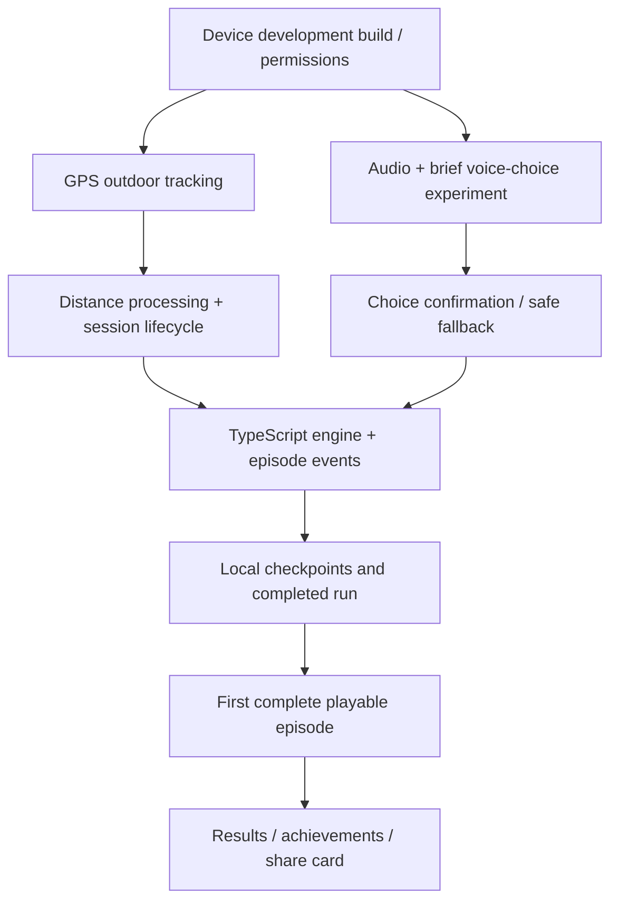

# Pursuit — Feature Set & MVP Requirements

**Status:** Initial MVP requirements, derived from the agreed game mechanics and technical architecture. Specific difficulty values, voice-recognition library, GPS tolerances, and UI layouts remain subject to testing.  
**Related:** [Game Mechanics & Product Design](./game-mechanics.md) · [Technical Stack & System Architecture](./tech-stack-and-architecture.md)  
**MVP content:** One complete, replayable campaign episode: *The Forest: First Escape*. Approximately 20–35 minutes is the intended experience, **not** a guaranteed time or distance.

## 1. Purpose and scope

This document converts the agreed gameplay into **features** (what players can do), **functional requirements** (how the app must behave), and **acceptance criteria** (observable evidence that a feature works). It is the development checklist, not a replacement for the detailed game-rules document.

**Priority labels:**
- **P0 — Essential MVP:** Required for a playable, safe, end-to-end episode.
- **P1 — MVP polish/progression:** Part of our intended complete MVP, but implement after the first playable vertical slice.
- **Later:** Not built in the MVP; architecture should not make future addition unreasonably difficult.

For P0, a missing or unreliable feature blocks the MVP. For P1, aim to ship it in the MVP, but do not delay early technical validation for it.

## 2. Feature summary

| ID | Feature group | Priority |
| --- | --- | --- |
| F01 | Campaign, episode and difficulty selection | P0 |
| F02 | GPS running tracker | P0 |
| F03 | Audio-driven story and distance checkpoints | P0 |
| F04 | Voice decisions and branching | P0 |
| F05 | Physical challenges and virtual pursuit | P0 |
| F06 | Health, outcomes and fail-forward tracking | P0 |
| F07 | Session lifecycle and safe pausing | P0 |
| F08 | Local saves and interrupted-session recovery | P0 |
| F09 | Results, progression and achievements | P1 |
| F10 | Optional results-card sharing | P1 |
| F11 | First-run onboarding and permissions | P0 |

## 3. Detailed requirements and acceptance criteria

### F01 — Campaign, episode and difficulty selection (P0)

**Player-facing features**
- Browse available campaigns and episodes.
- Select an available episode.
- Choose **Easy, Medium, or Hard** before starting.

**Requirements**
- Display the single bundled campaign and *The Forest: First Escape* in the MVP. Do **not** require multiple campaigns or episodes just to justify a selection screen.
- Structure the content/catalog so future campaigns and episodes can be added without redesigning the entire application.
- Indicate which episodes are available; future locked/unreleased content does not need a complex unlock UI yet.
- Show a short episode description and practical play/equipment guidance before starting.
- The chosen difficulty determines authored, **fixed** physical objectives for the selected story route. Do not dynamically lower objective standards based on inferred ability.

**Acceptance criteria**
- A player can launch the bundled episode at any of the three difficulties.
- Restarting at the same difficulty and taking the same choices yields the same authored challenge requirements.
- The screen does not falsely suggest the MVP includes multiple playable episodes.

### F02 — GPS running tracker (P0)

**Player-facing features**
- Record the outdoor run: distance, pace, moving time, and total elapsed time.
- Continue tracking when the screen is locked, subject to device permissions and operating-system constraints.

**Requirements**
- Track **cumulative travel distance**, including laps and routes that return to the start; never use distance-from-origin for episode progression.
- Calculate useful pace metrics; label live pace as an estimate and keep average moving pace distinct from total elapsed time.
- Handle poor GPS accuracy, impossible position jumps, temporary reception loss, and permission loss conservatively.
- Do not use ambiguous or missing GPS data to automatically fail an objective or remove health.
- Establish actual sampling/battery/accuracy tolerances through outdoor field tests, **not arbitrary thresholds**.
- The MVP is outdoor-only; no treadmill travel estimation and no route/navigation directions.

**Acceptance criteria**
- An actual phone records a simple outdoor run while locked and produces plausible cumulative distance, including on a repeated loop.
- A temporary GPS outage or obviously invalid jump does not invent large movement or silently cause a health penalty.
- Run totals remain accessible when the mission is failed or stopped.

### F03 — Audio story and distance-based progression (P0)

**Player-facing features**
- Hear prerecorded narration, radio dialogue, and sound cues during the run.
- Experience story checkpoints triggered by accumulated distance.

**Requirements**
- Bundle the complete first episode's story definitions and prerecorded audio so gameplay does not require mobile data.
- Trigger major story checkpoints based on **distance**, not universal elapsed minutes.
- Support story segments with calmer running/recovery, optional choices, unavoidable encounters, and later reconvergence.
- Play distinct success/failure narration for relevant challenges.
- Handle incoming-call/audio interruptions and playback resume where technically feasible; test Bluetooth/headphone behavior.
- Do not present fictional story-route choices as instructions to navigate real roads.

**Acceptance criteria**
- With the phone offline after installation, a runner can progress through story checkpoints and hear the intended dialogue.
- Two simulated players moving at different speeds encounter a given distance checkpoint after the same cumulative mission distance.
- Audio and episode state remain consistent across pause/resume and common interruptions.

### F04 — Short voice decisions and branching (P0)

**Player-facing features**
- Respond to fictional radio prompts using short voice commands during optional choices.
- Use a screen-based alternative **when safely stopped**.

**Requirements**
- Limit listening to brief, explicit decision windows; do not continuously listen.
- Each optional choice clearly offers two alternatives and explains material trade-offs and any hazardous failure consequence.
- Recognize a small command set such as “Gate” and “Detour”; confirm the recognized choice before committing.
- On unclear input, allow a retry with in-story radio-interference feedback; after unsuccessful attempts, apply a predetermined safer fallback.
- **Never** treat misunderstood speech, lack of a microphone, or failure to respond as intentional acceptance of a hazardous choice.
- Intention and athletic performance are separate: current running speed must not automatically choose a risky route, and choosing it must not demand an extra artificial acceleration.
- Offline/on-device recognition is the preferred solution, but the actual library and device support **must be validated**. If it is not reliable enough, revisit implementation without weakening the safety fallback.

**Acceptance criteria**
- A runner can make a confirmed branch choice with a short spoken command in a realistic test.
- Noisy/unrecognized input reaches retry and then safe fallback without a health penalty.
- An already-fast runner can deliberately choose a risky option without having to accelerate merely to register the choice.
- A stopped player can access the alternative choice UI.

### F05 — Physical objectives, challenge evaluation and pursuit (P0)

**Player-facing features**
- Attempt timed escape objectives, pursuit segments, endurance challenges, and authored combinations of effort and recovery as used in the first episode.
- Hear audio feedback that communicates urgency, progress, failure, and relief.

**Requirements**
- Start each challenge's own timer/distance measurement **when that challenge activates**, independent of time taken to reach the story checkpoint.
- Evaluate performance against fixed objectives for the selected difficulty and route; preserve route trade-offs (shorter/intense versus longer/steadier).
- Unavoidable encounters automatically begin; optional risky encounters require explicit selection.
- Implement a virtual pursuer only where the authored episode uses one, under fixed rules. Do not assume every challenge is a chase.
- Challenge outcomes control the subsequent authored story node and any stated health consequence.
- Uncertain location or timing inputs require safe, explicitly designed handling; do not silently invent success or failure.
- Exact pace, distance, and timing values will be authored and playtested separately, not taken from brainstorming examples.

**Acceptance criteria**
- Automated tests with simulated movement/timing produce reproducible pass/fail outcomes at each selected difficulty.
- The same difficulty/route always uses the same published objective.
- An unavoidable encounter starts without requiring a spoken route decision.
- Failure on an optional hazardous route can trigger its authored detour and narration.

### F06 — Health, consequences and fail-forward workout tracking (P0)

**Player-facing features**
- See or hear current mission health and the consequence of failed hazardous objectives.
- Continue recording the real workout even if the fictional mission ends.

**Requirements**
- Deduct health **only** when an expressly identified hazardous physical challenge is failed and its consequence was communicated.
- No random damage for story beats, selecting a safer detour, pausing for safety, poor GPS, or unsuccessful voice recognition.
- Give each failed challenge coherent in-story setback narration rather than suggesting repeated literal deaths.
- After a damaging encounter, provide an authored lower-pressure transition instead of an immediate unexplained sprint.
- At zero health: mark the mission failed, stop further story challenges, announce the failure/retreat, and **keep the real run tracker active** until the player ends it.

**Acceptance criteria**
- Safe choices, pauses, and sensor/recognition failures never reduce health.
- Simulating zero health stops mission progression but does not stop workout timing/distance recording.
- Final results distinguish mission outcome from the physical workout record.

### F07 — Session lifecycle and safe pausing (P0)

**Player-facing features**
- Start, pause, resume, and end a session.
- Pause at stoplights or whenever safety requires, without punishment.

**Requirements**
- Maintain separate states for the fictional mission and real workout where their lifecycles differ.
- Pausing freezes mission challenge and story progression without an automatic health penalty.
- Overall elapsed time continues during a pause; moving time is tracked and labeled separately.
- Resume with a short warning/countdown and never unexpectedly demand an immediate sprint.
- Record interruptions and pauses where required for separate uninterrupted-challenge achievements.
- Exact paused-active-objective and uninterrupted-award handling is **pending field tests**; do not invent detailed competitive qualification rules prematurely.

**Acceptance criteria**
- Pausing during a test session does not cost health and does not advance story checkpoints or challenge timers.
- Elapsed and moving time are distinguishable after the session.
- On resume, the player receives a safe lead-in.
- A failed mission can still have an active workout that the player later ends.

### F08 — Local persistence and session recovery (P0)

**Player-facing features**
- Retain completed runs and episode progress on the same phone without an account.
- Recover an interrupted run to the extent supported and reliably tested.

**Requirements**
- Save run metadata, confirmed decisions, challenge outcomes, progression, and important checkpoints in on-device SQLite.
- Checkpoint during runs instead of saving only at completion.
- Version episode content and stored state sufficiently to interpret historical outcomes after updates.
- Avoid collecting/storing unnecessary raw GPS coordinates; establish a retention/deletion approach before release.
- Acknowledge that local-only data is not guaranteed to survive device loss or app uninstall.

**Acceptance criteria**
- A finished run and its result are available after closing and reopening the app.
- A deliberately interrupted test run retains its last successfully persisted checkpoint and does not silently fabricate lost distance.
- Normal gameplay and local saving work without an internet connection.

### F09 — Results, progression and achievements (P1)

**Player-facing features**
- Review completed and failed run results and local run history.
- Receive meaningful achievements and progression for accomplishments.

**Requirements**
- Show episode/difficulty, clear or failed status, distance, average moving pace, moving time, total elapsed time, and relevant route/health outcomes.
- Support replay for higher difficulties, alternate branches, and better personal accomplishments.
- Track achievements such as difficulty clears, full-health clears, and route-specific accomplishments; uninterrupted achievements require explicit, validated qualification rules.
- Support XP/progression without granting extra health or other gameplay powers that compromise fixed-standard difficulty clears.
- Do not assume finishing times are directly comparable across routes with different allowed distances.

**Acceptance criteria**
- A completed or failed session produces an accurate local result and remains visible in history.
- Eligible achievements are awarded consistently when replaying the same simulated outcomes.
- Difficulty/route and both time metrics are clearly labeled.

### F10 — Optional result sharing (P1)

**Player-facing features**
- Optionally share a result card through the phone's available share functionality.

**Requirements**
- Generate a card with appropriate episode, difficulty, mission result, supported statistics, and earned badges.
- Sharing is strictly optional and requires no account, public feed, leaderboard, or server.
- Do **not** include raw GPS coordinates or an identifiable route by default.
- Distinguish moving from elapsed time and avoid misleading comparisons between different route lengths.

**Acceptance criteria**
- Player can review a card and choose whether to invoke the system share interface.
- Declining sharing has no effect on saved progress; no raw route location appears on the default card.

### F11 — First-run onboarding and permissions (P0)

**Player-facing features**
- Understand what is required before starting: smartphone essential; headphones/microphone strongly recommended; outdoor location permissions required for GPS gameplay.

**Requirements**
- Explain why location access, supported background location permission, and microphone permission are needed at the point of use.
- Explain outdoor-only play, fictional/non-navigational story routes, awareness of surroundings, safe pausing, and appropriate audio volume.
- Clearly handle denied or unavailable permissions instead of starting a challenge that cannot be fairly measured.
- Make the stopped-screen alternative discoverable when voice input is unavailable.

**Acceptance criteria**
- A first-time user understands the hardware and permission requirements before starting.
- Denied location/background permissions lead to a clear explanation and no misleading attempt at a fully tracked run.

## 4. Non-functional requirements

- **Offline operation:** All core gameplay, bundled episode audio, and local saves operate offline once the app is installed.
- **Cross-platform:** Target iOS and Android using shared React Native/TypeScript logic; test actual devices and handle necessary platform differences.
- **Background reliability:** Test locked-screen tracking, interruptions, and operating-system restrictions; do not promise uninterrupted operation on every device.
- **Responsiveness:** Core challenge evaluation must not wait for network requests.
- **Data integrity:** Recover from interruptions using persisted checkpoints; keep workout records separate from mission success.
- **Accessibility and safety:** Hands-free voice is the intended decision method, with retries/fallback and stopped-screen alternatives; audio must not require unsafe volume.
- **Battery:** Profile outdoor GPS and audio usage on representative devices; choose tolerances after measurement.
- **Privacy:** Local-first storage, minimal sensitive location retention, and no default public sharing.

## 5. Implementation dependencies and initial vertical slice

**First technical validation:** On a real phone, start an outdoor run, lock the screen, collect plausible cumulative distance, trigger a bundled audio event, take a voice choice (or safe fallback), and persist the session. This should be proven before investing heavily in polished menus, expanded content, or progression screens.

## 6. Explicit exclusions and future features

**Not required for the MVP:** user accounts, FastAPI, PostgreSQL, cloud saves, global leaderboards, multiplayer, community posting, many campaigns/episodes, treadmill support, mandatory wearables, real-world navigation, continuously listening voice assistant, dynamically personalized difficulty, or purchasable content.

Potential **later** features: additional campaigns/episodes, optional account-based cloud backup, cloud-delivered episode packs, leaderboards with appropriately validated run data, social features, and expanded accessibility options.

Do not build empty infrastructure for these features during the MVP; only avoid needlessly blocking them with data-model or content-format choices.

## 7. Open decisions / validation questions

These are deliberately **not** claimed as finalized requirements:
1. Which speech-recognition integration works well enough for short commands during outdoor running, preferably offline, on both target platforms?
2. What GPS quality thresholds and recovery behavior are reliable for very short challenges and tight loops?
3. Precisely how should a paused active objective resume, and what makes an uninterrupted-challenge badge eligible?
4. What are the balanced Easy, Medium, and Hard values for each authored challenge after real-world playtesting?
5. What minimum GPS sample history is useful to store, and how long should it be retained?

Resolve these with prototypes, device tests, and the first episode's playtests rather than inventing requirements now.
