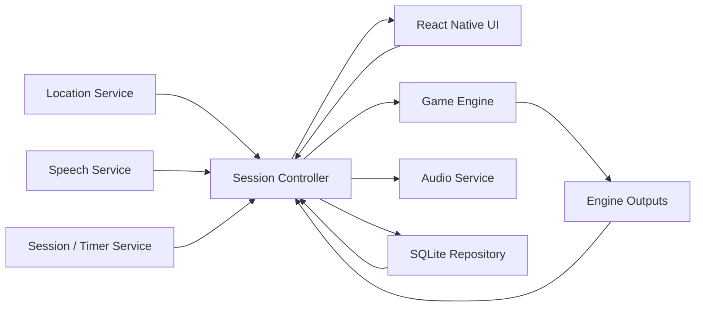
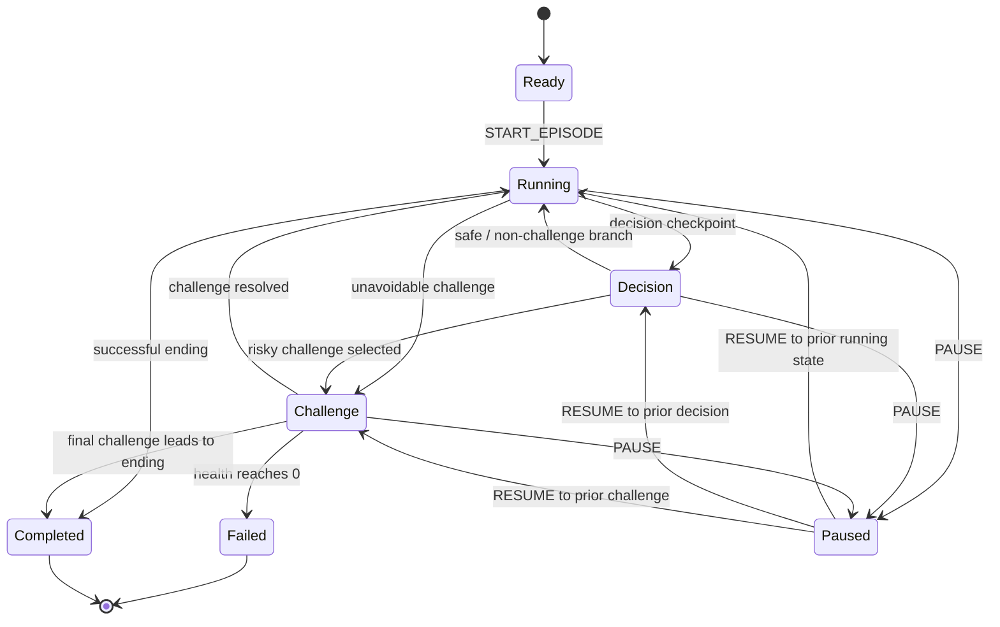

# Pursuit — Game Engine Design

**Status:** Initial engine architecture for the MVP  
**Scope:** Local TypeScript game engine for *The Forest: First Escape*  
**Related:** [Game Mechanics & Product Design](./game-mechanics.md) · [Feature Set & MVP Requirements](./features.md) · [Use Cases & User Flows](./use-cases-and-user-flows.md) · [Technical Stack & System Architecture](./tech-stack-and-architecture.md)

## 1. Purpose

The Pursuit game engine is the local gameplay/business-logic layer that runs directly on the player's mobile device.

It is responsible for answering:

> Given the current game state and a new event, what should the new state be, and what should the application do next?

The engine does **not** directly interact with GPS hardware, the microphone, audio playback, React Native components, or SQLite. Those concerns belong to surrounding application services.

Conceptually:

```text
Device / UI Events
        ↓
   Game Engine
        ↓
Updated Game State
        +
Engine Outputs
```

The engine should be deterministic, testable, and independent of React Native so a complete run can be simulated in automated tests without physically running.

## 2. Responsibilities

The engine is responsible for:

- Knowing the current campaign/episode and content version.
- Knowing the selected difficulty.
- Tracking the current mission state.
- Tracking the current story node and branch history.
- Evaluating challenge progress and outcomes.
- Managing health and mission failure.
- Handling deliberate route choices.
- Handling pause/resume at the game-rule level.
- Determining when story checkpoints and challenges activate.
- Emitting standardized outputs for audio, UI, persistence, and session coordination.
- Producing a serializable state that can be checkpointed and restored.

The engine is **not** responsible for:

- Reading raw GPS coordinates from the operating system.
- Calculating low-level GPS filtering from latitude/longitude samples.
- Starting microphone capture.
- Performing speech recognition.
- Playing sound files.
- Rendering screens.
- Writing SQL directly.
- Managing cloud/network requests.

## 3. High-level architecture



The session controller acts as the adapter between real device services and the pure engine.

## 4. Core engine model

The engine should maintain one serializable `GameState` object for the active mission.

### 4.1 Game state

Conceptual TypeScript model:

```ts
type MissionStatus =
  | "ready"
  | "running"
  | "decision"
  | "challenge"
  | "paused"
  | "failed"
  | "completed";

type Difficulty = "easy" | "medium" | "hard";

type GameState = {
  campaignId: string;
  episodeId: string;
  contentVersion: string;

  difficulty: Difficulty;
  status: MissionStatus;

  currentStoryNodeId: string;
  visitedStoryNodeIds: string[];

  health: number;

  totalDistanceMeters: number;
  movingTimeSeconds: number;
  elapsedTimeSeconds: number;

  activeDecision?: ActiveDecision;
  activeChallenge?: ActiveChallenge;

  previousStatusBeforePause?: MissionStatus;

  missionStartedAt?: string;
  missionCompletedAt?: string;
};
```

This is conceptual. Exact field names can change during implementation.

## 5. Story state

The engine needs to know where the player is in the episode and what has already happened.

Important story information includes:

- Current story node.
- Previously visited nodes.
- Selected branches.
- Whether the player is waiting on a decision.
- Whether the current node starts a challenge.
- The next valid story transition.
- Whether the mission has reached a successful ending or failure state.

### 5.1 Story node model

Episodes should be data-driven rather than hardcoded with large chains of `if` statements.

Conceptual model:

```ts
type StoryNodeType =
  | "narration"
  | "decision"
  | "challenge"
  | "recovery"
  | "ending";

type StoryNode = {
  id: string;
  type: StoryNodeType;

  trigger?: {
    type: "distance";
    distanceMeters: number;
  };

  audioId?: string;

  nextNodeId?: string;

  decisionId?: string;
  challengeId?: string;

  endingType?: "success" | "failure";
};
```

Example episode content:

```json
{
  "id": "gate_choice",
  "type": "decision",
  "trigger": {
    "type": "distance",
    "distanceMeters": 1000
  },
  "audioId": "gate_choice_prompt",
  "decisionId": "gate_or_detour"
}
```

The engine should not care where the audio file lives. It only emits the audio/content identifier.

## 6. Decision model

Optional choices must be explicit and confirmed.

The engine should never infer a risky decision from pace, GPS movement, or failed speech recognition.

Conceptual model:

```ts
type DecisionOption = {
  id: string;
  label: string;
  nextNodeId: string;
  hazardous: boolean;
};

type DecisionDefinition = {
  id: string;
  options: DecisionOption[];
  fallbackOptionId: string;
};

type ActiveDecision = {
  decisionId: string;
  status: "awaiting_input" | "confirmed";
  confirmedOptionId?: string;
};
```

Example:

```json
{
  "id": "gate_or_detour",
  "options": [
    {
      "id": "gate",
      "label": "Gate",
      "nextNodeId": "gate_challenge",
      "hazardous": true
    },
    {
      "id": "detour",
      "label": "Detour",
      "nextNodeId": "service_road",
      "hazardous": false
    }
  ],
  "fallbackOptionId": "detour"
}
```

Speech recognition lives outside the engine. The engine receives only a confirmed semantic choice such as `"gate"`.

## 7. Challenge model

Challenges define objective physical requirements.

The engine should support at least the challenge types required by the first episode:

- Distance within time.
- Pursuit / virtual threat.
- Endurance / minimum pace over a segment.
- Authored sequences of effort and recovery where needed.

### 7.1 Challenge definition

Conceptual model:

```ts
type ChallengeType =
  | "distance_time"
  | "pursuit"
  | "endurance";

type ChallengeRequirement = {
  targetDistanceMeters?: number;
  timeLimitSeconds?: number;
  minimumPaceSecondsPerKm?: number;
};

type ChallengeDefinition = {
  id: string;
  type: ChallengeType;

  requirements: Record<Difficulty, ChallengeRequirement>;

  hazardous: boolean;
  healthPenaltyOnFailure: number;

  successNodeId: string;
  failureNodeId: string;

  successAudioId?: string;
  failureAudioId?: string;
};
```

Example only:

```json
{
  "id": "closing_gate",
  "type": "distance_time",
  "requirements": {
    "easy": {
      "targetDistanceMeters": 200,
      "timeLimitSeconds": 90
    },
    "medium": {
      "targetDistanceMeters": 200,
      "timeLimitSeconds": 75
    },
    "hard": {
      "targetDistanceMeters": 200,
      "timeLimitSeconds": 60
    }
  },
  "hazardous": true,
  "healthPenaltyOnFailure": 1,
  "successNodeId": "gate_escape_success",
  "failureNodeId": "gate_escape_failure"
}
```

These numbers are illustrative only. Final values require playtesting.

### 7.2 Active challenge state

```ts
type ActiveChallengeStatus =
  | "active"
  | "passed"
  | "failed"
  | "paused"
  | "unresolved";

type ActiveChallenge = {
  challengeId: string;
  status: ActiveChallengeStatus;

  distanceAtStartMeters: number;
  elapsedAtStartSeconds: number;

  challengeDistanceMeters: number;
  challengeElapsedSeconds: number;
};
```

Challenge progress should be calculated relative to the moment the challenge begins, not from the overall start of the run.

## 8. Engine input events

The engine receives semantic events from the session controller.

Conceptual event union:

```ts
type GameEvent =
  | { type: "START_EPISODE" }
  | {
      type: "RUN_METRICS_UPDATED";
      totalDistanceMeters: number;
      movingTimeSeconds: number;
      elapsedTimeSeconds: number;
    }
  | {
      type: "MEASUREMENT_UNRELIABLE";
      reason: "gps_accuracy" | "gps_lost" | "other";
    }
  | {
      type: "CHOICE_CONFIRMED";
      optionId: string;
    }
  | { type: "USE_DECISION_FALLBACK" }
  | { type: "PAUSE" }
  | { type: "RESUME" }
  | { type: "END_WORKOUT" }
  | {
      type: "RESTORE_STATE";
      state: GameState;
    };
```

Not every internal transition needs to be an external event.

For example, after receiving `RUN_METRICS_UPDATED`, the engine may internally determine:

1. a distance checkpoint was reached;
2. a challenge was passed;
3. health changed;
4. the next story node became active.

Avoid requiring the session controller to tell the engine about outcomes the engine can calculate itself.

## 9. Engine outputs

The engine should return standardized outputs describing what the surrounding app should do.

Conceptual output union:

```ts
type EngineOutput =
  | { type: "PLAY_AUDIO"; audioId: string }
  | {
      type: "DECISION_REQUIRED";
      decisionId: string;
      optionIds: string[];
    }
  | {
      type: "CHALLENGE_STARTED";
      challengeId: string;
    }
  | {
      type: "CHALLENGE_PROGRESS";
      challengeId: string;
      distanceMeters: number;
      elapsedSeconds: number;
    }
  | {
      type: "CHALLENGE_PASSED";
      challengeId: string;
    }
  | {
      type: "CHALLENGE_FAILED";
      challengeId: string;
    }
  | {
      type: "HEALTH_CHANGED";
      health: number;
      delta: number;
    }
  | {
      type: "MISSION_COMPLETED";
    }
  | {
      type: "MISSION_FAILED";
    }
  | {
      type: "SAVE_CHECKPOINT";
      reason: string;
    };
```

The exact output list can evolve.

The engine decides **what** happens. Other application layers decide **how** to perform it.

For example:

```text
Engine output:
PLAY_AUDIO("gate_escape_success")

Audio service:
Find bundled file and play it
```

## 10. State transitions

Primary mission states:



The implementation should preserve the previous active state when pausing.

Mission failure is separate from workout completion. After engine state becomes `failed`, the session controller may continue tracking the real run until the player ends it.

## 11. Example engine flow

Scenario:

- Player is running *The Forest: First Escape*.
- Difficulty is Hard.
- At 1000 m, the player reaches the gate choice.
- Player explicitly chooses Gate.
- Challenge requires 200 m within the configured Hard limit.
- Player succeeds.

Conceptual sequence:

```text
RUN_METRICS_UPDATED(totalDistance = 1002m)
        ↓
Engine notices gate_choice checkpoint
        ↓
status = decision
        ↓
Output: PLAY_AUDIO(gate_choice_prompt)
Output: DECISION_REQUIRED(gate_or_detour)

CHOICE_CONFIRMED("gate")
        ↓
Engine records branch
        ↓
Move to gate_challenge node
        ↓
status = challenge
        ↓
Store challenge start distance/time
        ↓
Output: CHALLENGE_STARTED(closing_gate)
Output: SAVE_CHECKPOINT

RUN_METRICS_UPDATED(...)
        ↓
Engine calculates challenge-relative progress
        ↓
Target reached before time limit
        ↓
Challenge = passed
        ↓
Move to success node
        ↓
status = running
        ↓
Output: CHALLENGE_PASSED
Output: PLAY_AUDIO(gate_escape_success)
Output: SAVE_CHECKPOINT
```

## 12. Health and mission-failure rules

The engine must preserve the product rules already defined elsewhere.

Health decreases only when:

- an authored challenge is hazardous;
- its consequence was communicated to the player;
- the player actually failed under sufficiently valid measurements.

Health does **not** decrease because of:

- GPS uncertainty.
- Speech-recognition failure.
- Lack of a microphone.
- Pausing.
- Choosing a safer route.
- Arbitrary story events.

On valid hazardous failure:

```text
challenge failed
      ↓
apply configured health penalty
      ↓
health > 0?
   ↙        ↘
 yes        no
  ↓          ↓
failure    mission
branch      failed
```

When health reaches zero:

- Engine marks mission `failed`.
- No further story challenges advance.
- Engine emits mission-failure outputs.
- The external workout/session tracker may continue until the player ends the physical run.

## 13. Pause and resume

When the engine receives `PAUSE`:

- Save the previous active mission state.
- Set status to `paused`.
- Freeze story/checkpoint progression.
- Freeze challenge-local progression.
- Do not change health.

Elapsed workout time is owned by the session layer and may continue increasing while mission state is paused.

When receiving `RESUME`:

- Restore the previous mission state.
- Emit an output allowing the controller/audio layer to provide a safe countdown if required.
- Do not immediately fabricate missed challenge time.

Exact competitive/uninterrupted-achievement rules for paused challenges remain a product/playtesting decision.

## 14. Unreliable measurements

Raw GPS quality handling belongs primarily to the location service, but the engine needs a semantic way to know when fair challenge evaluation is not possible.

The session controller may emit:

```ts
{
  type: "MEASUREMENT_UNRELIABLE",
  reason: "gps_lost"
}
```

The engine must not convert uncertain measurements directly into failure or health loss.

Depending on the finalized product rule, an active challenge may enter an `unresolved` or temporary hold state until reliable tracking returns.

Exact timing/tolerance behavior is intentionally not finalized until outdoor tests.

## 15. Persistence and restoration

The engine should expose serializable state.

The database layer may store checkpoints after:

- Episode start.
- Story-node transition.
- Confirmed route choice.
- Challenge start.
- Challenge pass/fail.
- Health change.
- Pause.
- Mission completion/failure.
- Other important periodic checkpoints chosen during implementation.

On application restart:

```text
SQLite checkpoint
      ↓
Session Controller
      ↓
GameEngine.restore(state)
      ↓
Revalidate permissions / device services
      ↓
Resume safely
```

The engine must never infer unrecorded movement or fabricate a result for time lost between the last checkpoint and restoration.

## 16. Engine API direction

A simple initial API could look like:

```ts
type EngineResult = {
  state: GameState;
  outputs: EngineOutput[];
};

class GameEngine {
  constructor(
    episode: EpisodeDefinition,
    initialState: GameState
  ) {}

  handle(event: GameEvent): EngineResult {
    // Apply deterministic game rules.
  }

  getState(): GameState {
    // Return current serializable state.
  }
}
```

Implementation does not need to use a class if reducer-style functions are cleaner.

An equally valid functional design:

```ts
function transition(
  state: GameState,
  event: GameEvent,
  episode: EpisodeDefinition
): EngineResult;
```

For the MVP, a pure reducer/state-machine style is attractive because it is easy to test and serialize.

## 17. Suggested engine folder structure

```text
engine/
├── index.ts
├── transition.ts
├── types/
│   ├── GameState.ts
│   ├── GameEvent.ts
│   ├── EngineOutput.ts
│   └── Difficulty.ts
├── story/
│   ├── StoryNode.ts
│   ├── Decision.ts
│   └── storyTransitions.ts
├── challenges/
│   ├── Challenge.ts
│   ├── evaluateChallenge.ts
│   └── challengeTransitions.ts
├── health/
│   └── applyHealthChange.ts
└── tests/
    ├── story.test.ts
    ├── challenge.test.ts
    ├── pause.test.ts
    └── mission-flow.test.ts
```

The exact structure should remain small initially. Do not create abstraction-heavy folders before the code requires them.

## 18. Testing strategy

The engine should be testable without React Native, Expo, GPS hardware, or SQLite.

### Unit tests

Examples:

- Reaching a distance checkpoint activates the correct node.
- Confirmed Gate choice selects the Gate branch.
- Speed alone does not select Gate.
- Failed speech recognition never affects health.
- Same difficulty/route uses the same challenge requirements.
- Valid challenge success transitions to the success node.
- Valid hazardous challenge failure applies configured health loss.
- Health reaching zero marks the mission failed.
- Pausing freezes mission/challenge state.
- Restoring serialized state produces the same logical mission state.

### Full simulated mission test

A test should eventually simulate an entire episode:

```text
start episode
→ update distance
→ trigger first encounter
→ pass challenge
→ continue
→ reach gate decision
→ choose gate
→ fail risky challenge
→ lose health
→ continue detour
→ complete final challenge
→ reach successful ending
```

This verifies that authored story data and engine transitions work together.

## 19. Design principles

1. **Pure rules first:** Keep engine logic independent from React Native and Expo.
2. **Data-driven content:** Episodes define nodes/challenges; avoid hardcoded episode-specific condition chains.
3. **One source of truth:** `GameState` represents the current logical mission state.
4. **Explicit choices:** Never infer hazardous choices from movement.
5. **Fair measurements:** Sensor uncertainty is not player failure.
6. **Deterministic difficulty:** Fixed difficulty/route inputs produce fixed requirements.
7. **Fail forward:** Mission failure never erases the workout.
8. **Serializable:** Engine state can be checkpointed/restored.
9. **Testable:** A full run can be simulated on a laptop.
10. **MVP simplicity:** Build only the abstractions needed for the first complete episode.

## 20. Open design questions

These remain intentionally unresolved until implementation/testing:

- Exact final `GameState`, `GameEvent`, and `EngineOutput` field names.
- Whether the implementation should use a class, reducer, or explicit state-machine library. Start simple unless a library provides clear value.
- Exact behavior of an active challenge when GPS quality becomes unreliable for an extended period.
- Exact pause/resume qualification rules for uninterrupted achievements.
- Final Easy/Medium/Hard challenge thresholds after playtesting.
- Whether GPS sample details belong in engine state at all; preferably they remain outside and only processed metrics enter the engine.

## 21. Recommended first implementation slice

Do **not** implement every engine concept at once.

Start with a small vertical slice:

1. Define `GameState`, `GameEvent`, and `EngineOutput`.
2. Support `ready → running`.
3. Process cumulative distance updates.
4. Trigger one distance-based story node.
5. Support one explicit decision.
6. Support one distance/time challenge.
7. Produce pass/fail transitions.
8. Add pause/resume.
9. Serialize/restore the state.
10. Write an automated test that completes this miniature story flow.

Once that works, expand it to the complete *The Forest: First Escape* episode.
