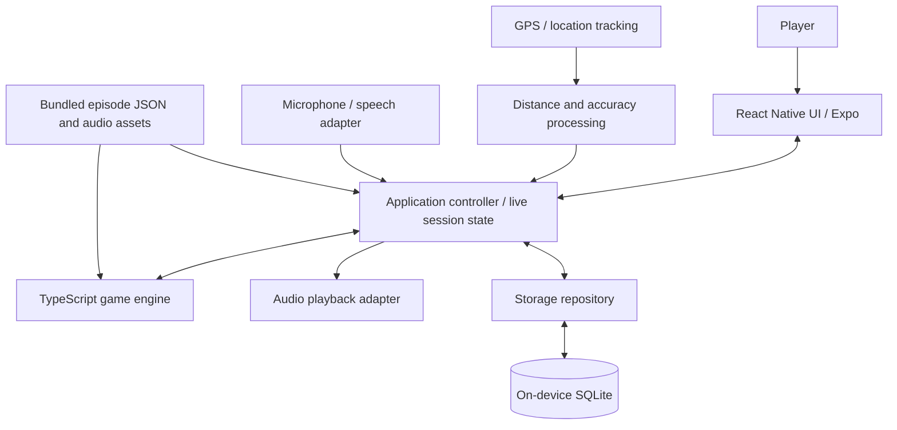

# Pursuit — Technical Stack & System Architecture

**Status:** Agreed MVP direction; integration details requiring device testing are explicitly marked  
**Related document:** [Game Mechanics & Product Design](./game-mechanics.md)  
**MVP:** One complete, replayable offline-first outdoor running episode, *The Forest: First Escape*

## 1. Architecture decisions

Pursuit is a mobile-first, audio-led running game in which a player's real-world movement and deliberate choices determine outcomes. For the MVP, **all core gameplay runs locally on the user's phone**. There is no required backend server, cloud database, account, or permanent network connection.

The simplest mental model is **Frontend → Game Engine → Local Database**, but that is a conceptual simplification rather than a strict request pipeline:

- The **frontend** presents screens, initiates actions, and reflects live state.
- The **game engine** applies fixed game rules to player decisions, movement measurements, and authored story events.
- **Device services** provide GPS updates, audio playback, and short voice-command recognition; these communicate with the application and the engine.
- The **local database** persists runs, checkpoints, results, and progression. The engine and application access it through a small storage layer.
- **Episode definitions and prerecorded audio** ship with the application for the first episode.

No HTTP request is required to advance a mission, process a challenge, or save progress.

### Core architectural goals

1. **Offline-first:** A complete episode must be playable without mobile data after installation.
2. **Game first:** GPS-measured outdoor performance drives real gameplay, not merely fitness statistics.
3. **Separate responsibilities:** UI, pure game rules, device integrations, content, and persistence should be independently testable.
4. **Reliable in motion:** Validate phone-locked/background behavior, GPS uncertainty, audio interruptions, and crash recovery early.
5. **Extend without premature infrastructure:** Leave room for optional FastAPI/PostgreSQL later, but do not build or deploy them for the MVP.
6. **Safety:** The app must accommodate stopping and pausing; uncertain sensors or failed speech recognition cannot silently cost health.

## 2. Selected MVP tech stack

| Area | Choice | Role |
| --- | --- | --- |
| Platforms | iOS and Android | One shared mobile codebase with platform-specific adaptations where required |
| Mobile framework | React Native with Expo | Native app UI and integration ecosystem |
| Language | TypeScript | Screens, application logic, and game engine |
| Navigation | Expo Router | File-based mobile navigation |
| Game engine | Plain TypeScript modules | Deterministic challenge evaluation, branching story, health, and scoring |
| Local structured storage | SQLite via `expo-sqlite` | Persistent run records, checkpoints, achievements, and progression |
| GPS / background location | `expo-location` and `expo-task-manager` | Outdoor movement tracking, including supported background execution |
| Audio | `expo-audio` | Prerecorded story narration, cues, and effects |
| Voice recognition | To be selected after on-device tests | Short decision-window commands, preferably offline/on-device |
| Auth / remote API / cloud DB | None for MVP | Not needed to play, track, or save locally |
| Builds / distribution | Expo development builds and EAS Build | Native-module testing and platform builds |
| Tests | Automated TypeScript tests plus real-device field testing | Game rules, persistence, tracking, and interruptions |

**Implementation note:** Verify current library APIs and native-platform support when development begins. Prefer Expo-supported modules but use a compatible native module or config plugin if voice recognition requires it. Expo Go is **not** the target test environment for background location and custom native speech integrations: use development builds on real phones.

We are **not** selecting a mapping/navigation SDK for the MVP. Story routes are fictional choices, not instructions to turn onto real streets.

## 3. System architecture



**All components above run on the phone.** Arrows show the main data paths, not independent deployed services. The controller orchestrates device events, the engine, UI state, audio, and persistence. The engine itself should not directly control GPS hardware, play audio, access SQLite, or import React Native UI components.

### Responsibilities

**Frontend (React Native + Expo)**
- Displays home, episode selection, run status, health, pause/resume, and results.
- Shows an alternative on-screen decision interface when the player is safely stopped.
- Receives live application state; does not independently calculate challenge results.

**Application controller / session state**
- Starts, pauses, resumes, restores, and finishes a running session.
- Converts validated GPS and recognized commands into events for the game engine.
- Coordinates sound cues and persistence in response to engine outputs.
- Keeps an in-memory snapshot of current gameplay state and checkpoints critical state to storage.

**Pure TypeScript game engine**
- Loads authored story rules and fixed Easy, Medium, and Hard challenge parameters.
- Applies confirmed optional choices; selects transitions and reconvergent branches.
- Evaluates distance/time or pursuit objectives, health changes, mission failure, and completion.
- Produces events/outcomes for the controller to persist and present.
- Must be unit-testable with simulated inputs, without needing a phone or database.

**Device adapters**
- **Location:** Collects GPS samples and processes cumulative route distance; filters obviously invalid jumps and handles insufficient accuracy without punishing the player.
- **Audio:** Plays bundled dialogue and sound effects; manages interruptions and audio focus where supported.
- **Speech:** Listens only during decision windows for a small command vocabulary, acknowledges confirmed choices, supports retry and a predetermined safer fallback, and exposes a safe stopped-screen alternative.
- Device APIs and permissions are platform-specific and must be tested on iOS and Android.

**Local persistence (SQLite)**
- Stores structured session and progression data through a dedicated repository layer.
- Writes checkpoints throughout an active run, not just on successful completion.
- Uses schema migrations as the local data model changes.

**Bundled content / files**
- Versioned JSON episode definitions describe checkpoints, transitions, choices, fixed difficulty challenges, and content IDs.
- Bundled prerecorded audio assets let the initial episode work offline.
- Avoid hardcoding narrative content into UI components or the engine.

## 4. Example end-to-end gameplay flow

1. The player selects *The Forest: First Escape* and Easy, Medium, or Hard. The controller loads bundled content, initializes engine state, and creates a local run record.
2. The location adapter collects position and accuracy updates. Distance processing computes plausible **cumulative travel distance**, including laps; it does not use straight-line displacement from the starting location.
3. The controller passes movement and timing events to the engine. When a distance checkpoint is reached, the engine emits a story event.
4. The controller plays the appropriate prerecorded audio. At an optional branch, a short speech-input window offers two explicit commands (with confirmation/retry/fallback); an unavoidable encounter needs no route-selection command.
5. After the player deliberately chooses a route, the engine activates that route's predefined objective. Actual measured performance determines success or failure.
6. The engine returns outcome and next-state events. The controller coordinates audio, UI updates, and a persistent checkpoint.
7. If mission health reaches zero, the engine stops story challenges **but the running tracker continues** until the player ends the workout.
8. On completion or ending the workout, save the session and display local results, records, progression, and relevant achievements.

**Pause semantics:** Pausing freezes mission events and challenge progression without health loss. Overall elapsed workout time continues. Moving time must be labeled separately. The exact treatment of paused active objectives and uninterrupted-achievement eligibility will be settled by field testing; safety comes first.

## 5. Local data model (initial direction)

This is a conceptual schema, **not finalized SQL**:

| Entity | Example fields / purpose |
| --- | --- |
| `runs` | Run ID, episode/content version, difficulty, status, start/end timestamps, moving time, elapsed time, total distance, mission outcome |
| `run_events` | Run ID, sequence/time, story event, confirmed choice, challenge result, health change |
| `run_checkpoints` | Run ID, resumable engine state, current story node, health, distance, timing and pause state |
| `gps_points` | Run ID, timestamp, coordinates, reported accuracy, accepted/rejected status; retain only when necessary for diagnostics or run history |
| `progress` | Episode clears and current player progression |
| `achievements` | Earned badges and their qualifying run |

Use stable IDs and version episode definitions so saved runs can be interpreted after content updates. Don't assume that saving only a final score will be sufficient.

**Data privacy:** GPS data can be sensitive. Collect only what gameplay needs, keep it on-device in the MVP, define a retention/deletion policy before release, and **never place raw GPS coordinates on shareable result cards by default**.

**Limits of local-only storage:** App uninstall/device loss can erase progress, and there is no cross-device sync. We accept this for MVP and can revisit optional backups later.

## 6. Suggested source layout

Illustrative structure, subject to Expo Router conventions:

```text
app/                 # Expo Router screens and navigation
components/          # Reusable presentation components
engine/              # Pure game rules: story, challenges, scoring, health
session/             # Live session controller and state
services/
  location/          # GPS adapter, distance validation
  audio/             # Playback and interruption coordination
  speech/            # Short-command speech adapter
database/            # SQLite setup, migrations, repositories
content/             # Bundled episode JSON / content schemas
assets/              # Bundled audio and graphics
tests/               # Pure-engine and application tests
docs/                # Product and architecture documentation
```

An engine method should accept plain input data and return new game state plus emitted game events. Avoid importing Expo modules into `engine/`; isolate them in `services/`. Persist through `database/` rather than running SQL inside UI components.

## 7. Key technical risks and MVP acceptance checks

The architecture is simple, but hardware and operating-system behavior create nontrivial engineering work:

1. **Background reliability:** An actual device must track an outdoor run while locked, within iOS/Android permission and battery restrictions. Test incoming calls and app interruptions. No mobile platform guarantees indefinite background execution.
2. **GPS fairness:** Test straight paths, a standard running track, tight loops, and tree-covered routes. Reject unrealistic jumps; establish handling for poor accuracy before setting hard measurement tolerances.
3. **Speech reliability:** Test commands such as “Gate” and “Detour” while breathing hard, in wind, and using different headphone microphones. Confirm whether an offline solution works adequately on both platforms.
4. **Audio coexistence:** Test narration plus brief listening windows, Bluetooth routing, playback recovery, and phone-call interruption behavior.
5. **Crash/restart recovery:** Save sufficient active-run checkpoints, then verify interruption and restoration paths. No lost run solely because the game narrative fails.
6. **Deterministic rules:** Unit-test fixed objectives, intentional risky selection, safe detours, health changes, difficulty consistency, pauses, and fail-forward workout tracking.
7. **Battery and permissions:** Measure battery impact on representative real devices; explain location/microphone permissions at the point of use.
8. **Safety:** Losing location accuracy or missing a spoken command must not cost health. Fictional route descriptions must never direct real-world navigation.

**First engineering milestone:** A real-device development build that records a phone-locked outdoor run, triggers a distance-based event, plays bundled dialogue, recognizes or safely falls back from a short voice choice, and saves progress locally.

## 8. Explicitly out of scope for the MVP

- FastAPI, PostgreSQL, hosted infrastructure, remote authentication, cloud saves, and online leaderboards.
- Multiplayer, treadmill support, wearables as a requirement, and real-world turn-by-turn routing.
- Generated story narration or an always-on speech assistant.
- Secretly adaptive physical thresholds that undermine fixed-difficulty challenge standards.

Optional **local results-card sharing** may use the phone's native share mechanisms. It needs no account or central server.

## 9. Possible post-MVP extension (not part of initial architecture)

If user accounts, cloud saves, leaderboards, or new-episode distribution become necessary, a separate **Python + FastAPI** server with **PostgreSQL** is our current preferred direction because of existing team familiarity. Treat the server as an **optional synchronization and shared-services layer**, not as the live decision-maker during a run:

```text
Phone: React Native UI + game engine + local SQLite
                 |
          Optional HTTPS sync
                 |
        FastAPI + PostgreSQL
```

Offline play should remain functional when the network or backend is unavailable. Competitive features would need careful score validation because locally calculated results can be manipulated.

## 10. Documentation boundaries

This document describes **how** Pursuit will be built. [Game Mechanics & Product Design](./game-mechanics.md) is the source of truth for **what the game does**: episode structure, radio decisions, fixed challenges, health, difficulty, pause rules, and player-facing features. Changes to technical implementation should preserve those agreed mechanics unless product decisions are explicitly revisited.
