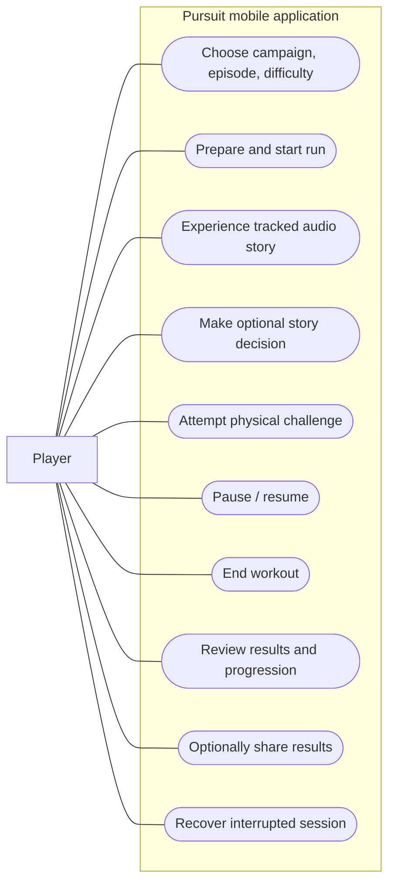
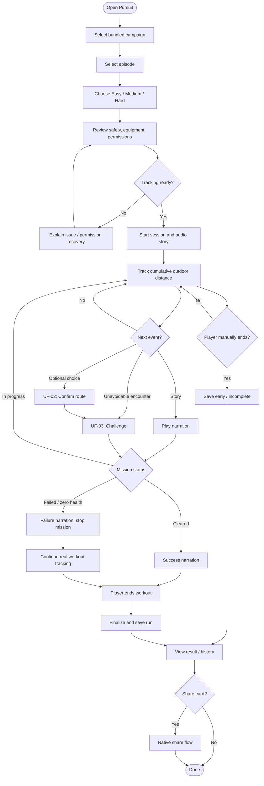
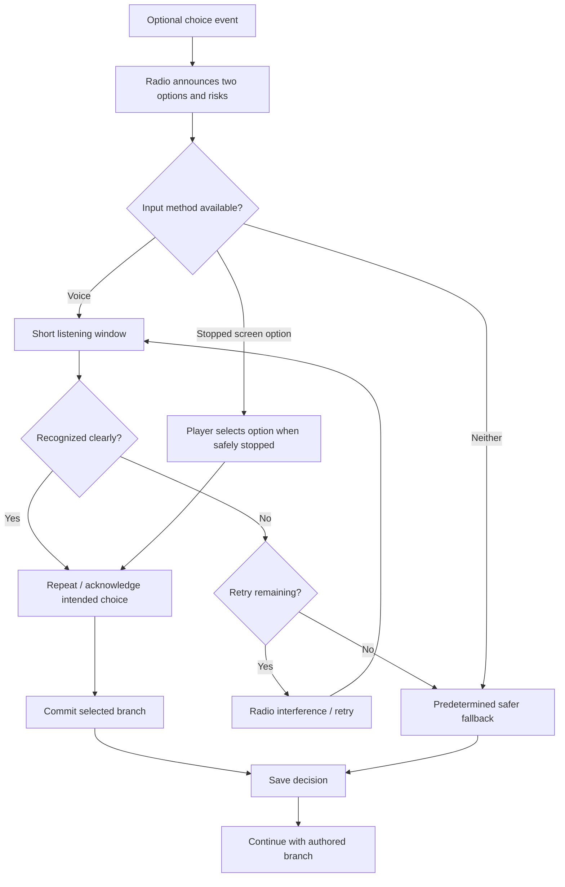
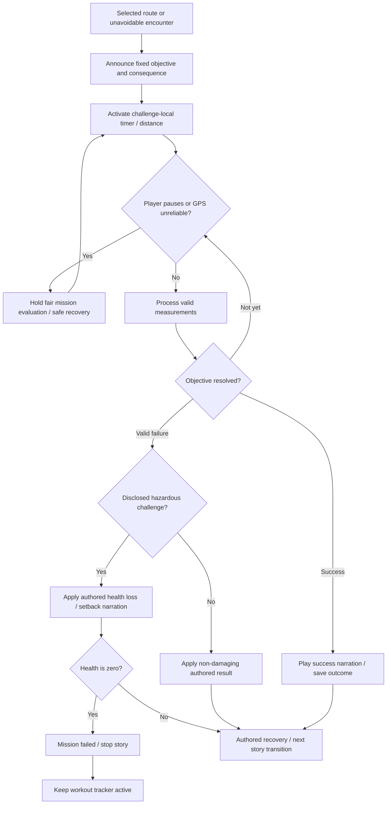
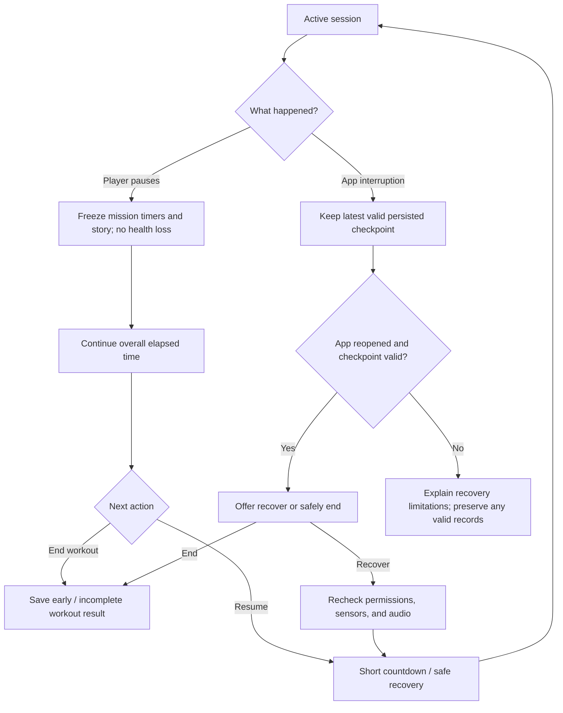
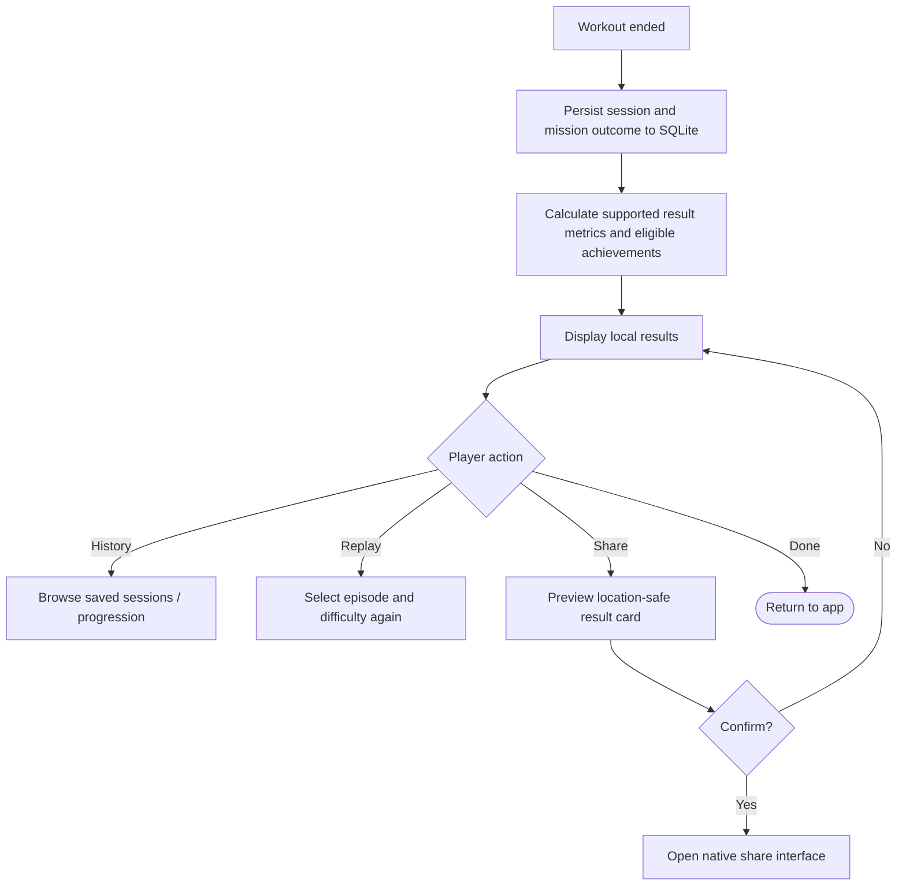

# Pursuit — Use Cases & User Flows

**Status:** Initial MVP specification  
**Scope:** One offline-first outdoor-running episode, *The Forest: First Escape*, with Easy, Medium, and Hard difficulties.  
**Related documentation:** [Game Mechanics & Product Design](./game-mechanics.md) · [Feature Set & MVP Requirements](./features.md) · [Technical Stack & System Architecture](./tech-stack-and-architecture.md)

## 1. Purpose and conventions

This document describes **how players interact** with Pursuit, including the normal experience and important alternative/error scenarios. A **use case** defines an actor's goal, trigger, preconditions, main sequence, alternative flows, and resulting state. A **user flow** visualizes sequences and decisions. Neither is a UI mockup or a detailed game-engine implementation.

**Primary actor:** Player. The MVP does not have accounts, administrators, other players, or a server. Phone GPS, operating-system permissions, microphone, and audio are **external dependencies**, not separate human actors.

**Terminology:**
- **Workout/run:** The physical activity record. It may continue after the fictional mission fails.
- **Mission:** The current episode's story progression, health, and challenges.
- **Distance checkpoint:** A cumulative-distance threshold that activates an authored story event.
- **Challenge:** An objective measured from its own activation point under fixed difficulty/route rules.
- **Explicit choice:** A confirmed decision, not an inference from current pace.
- **Pause:** Suspends mission progression without health loss; overall workout elapsed time remains measurable.
- **Success path:** An expected outcome, not a promise that native hardware works identically across devices.

**Design constraints:** Playable offline after installation; one bundled campaign/episode for MVP; safe pausing; fictional routes are **not real-world navigation**; no random health penalties or penalties for unreliable GPS/speech; locally stored progress. Do not fabricate final challenge thresholds or GPS tolerances before testing.

## 2. Use case index

| ID | Use case | Primary feature(s) | Priority |
| --- | --- | --- | --- |
| UC-01 | Browse and select campaign | F01 | P0 |
| UC-02 | Select episode | F01 | P0 |
| UC-03 | Select difficulty and review session | F01, F11 | P0 |
| UC-04 | Prepare and start an outdoor run | F02, F07, F11 | P0 |
| UC-05 | Track run and advance story | F02, F03, F08 | P0 |
| UC-06 | Hear a story event | F03 | P0 |
| UC-07 | Make an optional story choice | F04 | P0 |
| UC-08 | Attempt a physical challenge | F05, F06 | P0 |
| UC-09 | Pause and resume safely | F07 | P0 |
| UC-10 | Complete or fail mission and finish workout | F06, F07, F08 | P0 |
| UC-11 | Review history, results, and progression | F08, F09 | P1 |
| UC-12 | Optionally share a results card | F10 | P1 |
| UC-13 | Recover from an interrupted session | F02, F07, F08 | P0 |

Use case IDs identify behavior, **not individual screens**. UC-05 and UC-06, for example, occur as part of an active session without requiring repeated button presses.

## 3. Use case diagram

Mermaid does not natively implement full UML use-case notation. This **use-case overview** groups player goals rather than claiming to be strict UML:

System-initiated behavior (automatic distance checkpoint, unavoidable encounter, results saving) appears in the detailed use cases below.

## 4. Use case specifications

### UC-01 — Browse and select campaign

- **Actor / goal:** Player selects a campaign.
- **Trigger:** Player opens campaign selection.
- **Preconditions:** Application can read bundled content.
- **Main flow:**
  1. Application displays available campaigns.
  2. Player selects the campaign containing *The Forest: First Escape*.
  3. Application shows its episodes.
- **Alternative:** If bundled content cannot be read, display a recoverable error and do not start a session.
- **Postcondition:** Selected campaign is set; no running session has started.
- **MVP note:** Only one playable campaign is required. Do not invent extra campaigns or a server-backed catalog.

### UC-02 — Select episode

- **Actor / goal:** Player chooses an available episode.
- **Trigger:** Campaign is selected.
- **Preconditions:** Bundled episode catalog is available.
- **Main flow:**
  1. Application lists available episodes and short descriptions.
  2. Player selects *The Forest: First Escape*.
  3. Application proceeds to difficulty and pre-run preparation.
- **Alternative:** Unavailable or invalid content cannot be launched; show a clear explanation.
- **Postcondition:** Episode and its content version are selected.
- **MVP note:** One fully playable, replayable episode; the content model may support future additions.

### UC-03 — Select difficulty and review session

- **Actor / goal:** Player chooses appropriate published challenge standards and understands the session.
- **Trigger:** An episode is selected.
- **Preconditions:** Valid episode definition loaded.
- **Main flow:**
  1. Application offers **Easy**, **Medium**, and **Hard**.
  2. Player selects one and reviews the episode's general objective, approximate intended duration, outdoor requirements, audio/headphone advice, and safety guidance.
  3. Player proceeds to start preparation.
- **Alternative:** Player returns to episode selection without starting a session.
- **Postcondition:** The run configuration includes episode, content version, and selected difficulty.
- **Invariant:** Identical difficulty plus identical selected route uses identical authored challenge requirements. Do not secretly adapt difficulty to runner performance.

### UC-04 — Prepare and start an outdoor run

- **Actor / goal:** Player starts an outdoor, GPS-tracked audio episode.
- **Trigger:** Player selects Start after pre-run review.
- **Preconditions:** Supported device; episode and difficulty selected; app can request required permissions.
- **Main flow:**
  1. Application explains location/background requirements and requests relevant permission when needed; explains optional voice/microphone use.
  2. Application checks ability to start a trackable session and initializes the GPS, audio, engine, and local session record.
  3. Player intentionally starts.
  4. Application begins workout tracking and first story narration.
- **Alternatives:**
  - **A1 — Missing location/background capability:** Explain why a fully tracked episode cannot start; provide a path to adjust permissions. Do not start an apparently valid challenge without usable tracking.
  - **A2 — Microphone or headphones unavailable:** Explain speech-input limitations and available stopped-screen alternative. Never interpret lack of a microphone as a risky choice.
  - **A3 — GPS not yet reliable:** Show acquisition/quality feedback and prevent unfair timed evaluation until measurement is adequate. Exact quality thresholds remain a test decision.
  - **A4 — Player cancels:** Leave selection without creating a misleading completed run.
- **Postcondition:** Either a valid in-progress locally persisted session starts or player receives a clear blocking explanation.

### UC-05 — Track run and advance distance checkpoints

- **Actor / goal:** Player runs while the app records movement and automatically progresses the story.
- **Trigger:** Active session begins or resumes.
- **Preconditions:** Session active; location permission and suitable tracking available.
- **Main flow:**
  1. Device supplies timestamped location/accuracy samples while supported, including screen-locked operation.
  2. Application calculates **plausible cumulative distance along the traveled route**, moving time, elapsed time, and pace.
  3. Application checkpoints critical session state periodically and after major events.
  4. When accumulated mission distance reaches an authored threshold, engine emits the next story event (UC-06).
  5. The process continues until pause, mission end, workout end, or interruption.
- **Alternatives:**
  - **A1 — Tight loops or repeated laps:** Valid movement still increases cumulative distance, even if the player returns to the starting point.
  - **A2 — GPS uncertainty/outage/jump:** Do not invent distance or silently fail an objective or deduct health; enter a safe measurement-recovery state appropriate to the encounter. Precise timeout/accuracy policy is pending field tests.
  - **A3 — Phone locks:** Continue tracking where the operating system and permission model allow; ensure behavior is field-tested rather than assumed.
- **Postcondition:** Current run state and persisted checkpoints reflect only defensible measurements.

### UC-06 — Hear a story event

- **Actor / goal:** Player hears a narrative beat at the intended point of the run.
- **Trigger:** A distance checkpoint, story transition, or challenge outcome fires.
- **Preconditions:** Active mission and valid bundled event/audio content.
- **Main flow:**
  1. Engine identifies the authored event and next eligible transition(s).
  2. Application plays the corresponding bundled audio.
  3. Depending on event type, continue ordinary running, open an optional choice (UC-07), or activate an unavoidable encounter (UC-08).
  4. Save the event/transition as appropriate to prevent unintended replay after restoration.
- **Alternatives:**
  - **A1 — Audio interruption:** Coordinate playback recovery while keeping event state consistent; exact routing/resume behavior requires device tests.
  - **A2 — Pause:** Suspend mission progression; do not skip the unresolved event.
- **Postcondition:** Correct next mission state is available.
- **Invariant:** The fictional route does **not** instruct the player to take a specific real-world street or direction.

### UC-07 — Make an optional story choice

- **Actor / goal:** Player deliberately chooses between two authored alternatives, typically a shorter intense route and a longer lower-intensity detour.
- **Trigger:** An optional radio decision event activates.
- **Preconditions:** Mission active; alternatives and consequences are defined; no hazardous choice has been inferred.
- **Main flow:**
  1. Radio narration clearly explains two options and any stated health risk of failing a hazardous objective.
  2. Application opens a **short decision-only** speech-listening window.
  3. Player speaks a simple command (e.g., “Gate” or “Detour”).
  4. Application recognizes and **acknowledges** the intended option.
  5. Engine commits the confirmed selection, saves the decision, and activates the selected branch/objective.
- **Alternatives:**
  - **A1 — Recognition unclear / noisy surroundings:** Give an in-story retry. After unsuccessful attempts, use the predetermined safer fallback without health penalty.
  - **A2 — Voice unavailable:** Offer screen-based selection **when safely stopped** and retain the safe fallback.
  - **A3 — Player pauses:** Preserve the unresolved decision until resumed; no health loss.
  - **A4 — Player already running fast:** Speed never silently chooses an option; a fast runner may keep their pace after deliberately choosing a risky objective.
- **Postcondition:** Exactly one explicit or safe-fallback branch is recorded, without accidental risky commitment.
- **Invariant:** Choosing a safe detour is not failure and does not itself deduct health.

### UC-08 — Attempt a physical challenge

- **Actor / goal:** Player attempts a selected or unavoidable fixed objective through actual running.
- **Trigger:** Authored challenge starts after an encounter or confirmed branch choice.
- **Preconditions:** Mission active; objective/difficulty/route known; tracking sufficiently reliable to evaluate fairly.
- **Main flow:**
  1. Audio announces the objective, relevant time/distance/pursuit conditions, and material consequences.
  2. Engine starts **challenge-local** time/distance measurement at activation.
  3. Device measurements are processed while the player runs; engine updates challenge progress and triggers appropriate audio cues.
  4. On meeting the objective or reaching a valid failure condition, engine determines the result.
  5. Application plays distinct outcome narration, records it, and transitions to the authored next node.
- **Alternatives:**
  - **A1 — Player succeeds:** Continue along the success transition and record any qualification.
  - **A2 — Player fails a disclosed hazardous challenge:** Apply its defined health consequence, provide coherent setback narration and lower-pressure transition; a failed risky shortcut may force the longer detour.
  - **A3 — Player pauses:** No automatic damage; freeze mission challenge state. Exact handling of pause and uninterrupted-achievement eligibility remains pending playtests.
  - **A4 — Tracking is uncertain:** Suspend/unresolve unfair evaluation; never secretly deduct health for lost GPS.
  - **A5 — Unavoidable challenge:** Start automatically; **no selection command** is needed.
- **Postcondition:** A defensible outcome/transition is recorded, or the objective remains unresolved during safe pause/recovery.
- **Invariant:** Same difficulty and chosen route imply the same fixed standard; no hidden fatigue-based adjustment.

### UC-09 — Pause and resume safely

- **Actor / goal:** Player can stop for traffic, safety, or personal needs without punishment.
- **Trigger:** Player activates Pause during an active session.
- **Preconditions:** A run is in progress.
- **Main flow:**
  1. Player pauses.
  2. Application freezes **mission** timers, pursuit, events, and challenge progression; no health loss.
  3. Overall workout **elapsed time continues**; distinguish it from moving time in results.
  4. Player requests resume.
  5. Application issues a short lead-in/countdown and restores eligible mission activity without a surprise instant sprint.
- **Alternatives:**
  - **A1 — Pause during speech choice or challenge:** Preserve unresolved state. Precise mid-challenge resume rule and uninterrupted badge qualification await testing.
  - **A2 — Player ends run while paused:** Finish workout through UC-10 without marking the mission as an earned clear.
  - **A3 — Operating-system interruption:** Recover consistently with UC-13 where possible.
- **Postcondition:** Mission resumes safely or workout ends; pause alone causes no health penalty.

### UC-10 — Complete or fail mission and finish workout

- **Actor / goal:** Player finishes the fictional mission and/or concludes the real activity.
- **Trigger:** Episode success, mission health reaching zero, or player explicitly ending the session.
- **Preconditions:** Session in progress.
- **Main flow — successful mission:**
  1. Engine reaches the authored successful ending and marks mission **cleared**.
  2. Application plays completion narration and retains valid run data.
  3. Player finishes their workout; application saves final statistics, mission outcome, and eligible accomplishments.
  4. Player may open results (UC-11).
- **Alternatives:**
  - **A1 — Health reaches zero:** Mark mission **failed**, play coherent retreat/failure narration, stop story/challenge progression, **continue real workout tracking** until player finishes.
  - **A2 — Player manually ends before resolution:** Save as ended early/incomplete, not cleared. Do not invent achievement qualification.
  - **A3 — Player wants to finish tracking after mission end:** Keep the workout/session lifecycle distinct from the mission and allow a separately signaled workout finish. Exact successful-ending screen/audio interaction may be refined in UI design.
- **Postcondition:** Mission outcome and physical workout record are stored separately and accurately.

### UC-11 — Review results, local history, and progression

- **Actor / goal:** Player sees performance and accomplishments.
- **Trigger:** A run is saved or player opens history/progression.
- **Preconditions:** Locally stored information may or may not exist.
- **Main flow:**
  1. Player selects a saved run or opens its just-finished result.
  2. Application displays episode, difficulty, clear/failed/incomplete status, applicable route/health outcomes, distance, **moving time**, **total elapsed time**, and average moving pace.
  3. Show eligible local achievements, XP/progression, and personal accomplishments.
  4. Allow replaying the episode at the same/different difficulty to explore other routes.
- **Alternatives:**
  - **A1 — Empty history:** Show a helpful empty state.
  - **A2 — Run contains pauses/different route distance:** Label the measures clearly and avoid implying incompatible route times are directly comparable.
- **Postcondition:** No gameplay state is changed by reviewing history.
- **Priority note:** Results/progression polish is P1, though saving an accurate basic run outcome is essential P0 work.

### UC-12 — Optionally share a results card

- **Actor / goal:** Player shares an accomplishment voluntarily.
- **Trigger:** Player chooses Share from an eligible result.
- **Preconditions:** Result information exists on the device.
- **Main flow:**
  1. Application generates a preview of the results card.
  2. Player confirms sharing.
  3. Application opens the device's native share interface.
- **Alternatives:**
  - **A1 — Player cancels:** Return to results without changing progression.
  - **A2 — Sharing unavailable:** Show a non-blocking explanation; the underlying result remains saved.
- **Postcondition:** Sharing may be attempted by the operating system; the app must not claim external delivery unless confirmed.
- **Privacy invariant:** No raw GPS coordinates or identifiable route on the default card. No public feed, account, or cloud dependency.

### UC-13 — Recover from an interrupted session

- **Actor / goal:** Player does not lose the entire run after a crash, app termination, or supported interruption.
- **Trigger:** Application opens with an existing persisted in-progress session.
- **Preconditions:** At least one valid SQLite checkpoint exists.
- **Main flow:**
  1. Application identifies the unfinished local session and its last persisted checkpoint.
  2. Application presents recovery/discard options with enough context to prevent accidentally overwriting records.
  3. On recovery, restore defensible saved run and mission state.
  4. Verify permissions, tracking quality, and audio state; only restart active challenges when safe under finalized pause/recovery rules.
- **Alternatives:**
  - **A1 — Missing/incomplete samples since checkpoint:** Never fabricate movement; explain any unrecorded gap as necessary.
  - **A2 — Invalid/incompatible saved state:** Protect existing valid workout data; offer safe end/discard recovery rather than silently marking a clear.
  - **A3 — Player declines restoration:** End/discard according to clearly presented options; do not silently erase unrelated saved history.
- **Postcondition:** Session safely resumes or is explicitly closed; never award a result unsupported by recorded data.
- **Technical caveat:** Phone operating systems may stop background work. Recovery mitigates but does not guarantee uninterrupted recording.

## 5. User flows

### UF-01 — Main player journey

This diagram is the top-level happy path plus mission failure/manual end; detailed exceptional handling appears below.

**Parallel action not fully shown:** Pausing and restoration can occur throughout an active workout; see UF-04. The event router in implementation should select only the event(s) eligible at the current story node, not activate unrelated branches simultaneously.

### UF-02 — Optional radio decision

**Rules:** Speech problems never cost health; the app must not infer a hazardous shortcut from the user's speed. UI implementation must not require looking at the screen while running.

### UF-03 — Challenge, consequences, and mission failure

The exact numeric objectives and GPS recovery/resume policy are **not yet finalized**; the flow expresses agreed fairness and fail-forward behavior.

### UF-04 — Pause, interruption, and restore

Whether tracking continues during a user-initiated **pause**, beyond elapsed time and already-recorded movement, requires a precise UI/engineering decision. What **is** fixed: the mission is frozen, no health is lost, and moving versus elapsed time must be clearly distinguished.

### UF-05 — Local results and optional sharing

## 6. Cross-cutting rules that every flow must preserve

1. **Workout and mission have separate states.** Losing the mission never automatically discards or ends the physical activity record.
2. **Pausing is permitted for safety** and never independently deducts health.
3. **Health only decreases** on failure of clearly disclosed hazardous physical objectives; not from GPS uncertainty, missed voice commands, or choosing the safe route.
4. **Choices are deliberate.** Running speed affects the result of a selected challenge, not the selection itself.
5. **Distance progression is cumulative** along the route; runners may use repeated loops.
6. **Challenges have their own activation-relative measurements**, distinct from distance checkpoints.
7. **Local-first, offline play:** No accounts, backend requests, or network dependency to finish the first episode.
8. **Fictional routes are not navigation advice.** Real-world traffic, obstacles, and personal safety override in-game urgency.
9. **Fixed difficulty standards:** Easy, Medium, and Hard do not silently self-adjust based on a user's fatigue.
10. **Do not invent achievement qualification** for paused/uncertain measurements before its rules have been playtested and documented.

## 7. Traceability and next documents

Use the UC IDs when opening implementation and test issues. F IDs map to [features.md](./features.md); game-rule details remain authoritative in [game-mechanics.md](./game-mechanics.md).

The following are deliberately unresolved design/test questions, not missing implementation instructions:
- Precise handling of a paused active timed objective and criteria for an uninterrupted-challenge badge.
- Background recording and recovery guarantees achievable on supported iOS/Android devices.
- GPS validation thresholds and behavior during prolonged loss of sufficiently accurate location.
- Which short-command recognizer works reliably offline on the selected device range.
- Final episode narration, authored branch nodes, and challenge values after real-world playtesting.

**Recommended next design artifact:** A game-engine state/event specification based on UC-05 through UC-10 and UC-13, followed by an ER diagram derived from what these flows need to persist.
