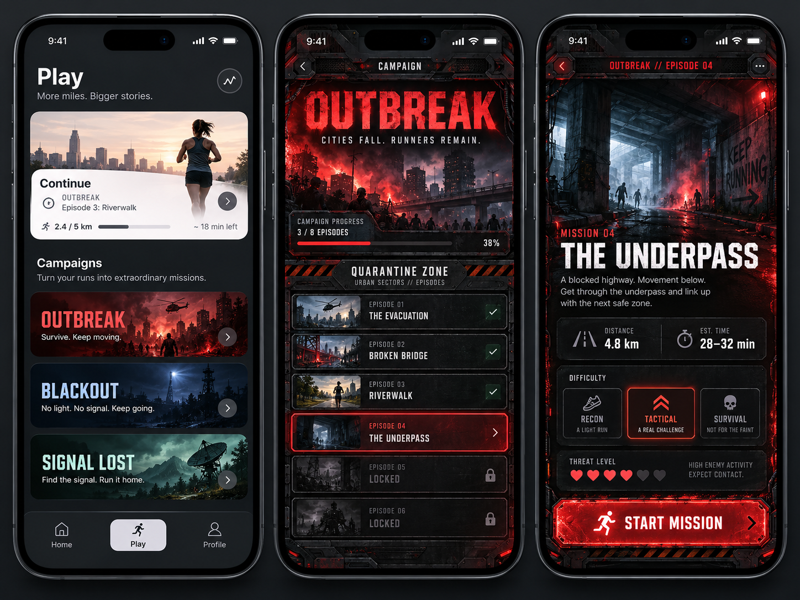
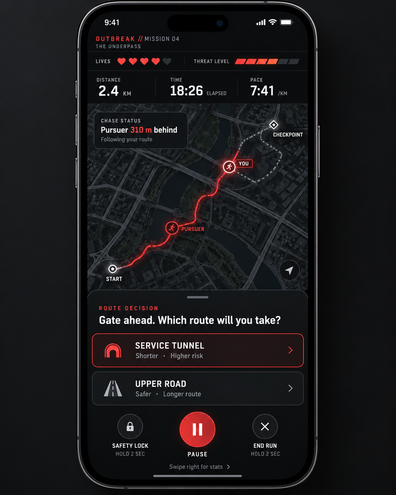
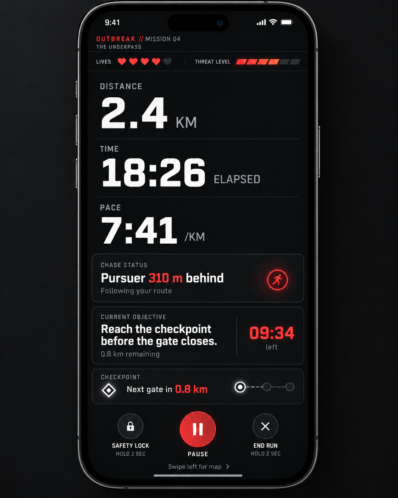

# UX/UI Design

## Purpose

This document captures the current UX/UI direction for Pursuit.

The main design goal is to combine:

- the clarity and usability of a modern running app
- the personality and immersion of an arcade-style story game

The app should feel clean and familiar during normal use, then become more theatrical once the player enters a campaign.

The core visual principle is:

> **Clean app shell outside the story. Campaign-specific personality inside the story. Running-first UX during the actual workout.**

---

# Overall Design Direction

Pursuit should not look like a traditional mobile game everywhere.

The general app should feel polished, modern, and easy to use, similar to a premium fitness or running app.

The stronger game styling appears when the player enters a campaign.

This creates a clear separation between:

- managing runs and progress
- choosing a campaign
- entering the story
- actively running

The app itself has one stable identity, while each campaign can have its own visual identity.

---

# Visual Layers

The product should use three levels of visual intensity.

## 1. Clean App Shell

Used for:

- Home
- Profile
- general activity history
- general statistics
- settings
- Play / campaign browsing

Style:

- clean layouts
- modern typography
- large cards
- simple navigation
- restrained color
- minimal decoration
- high readability

The Play screen may show campaign artwork, but the surrounding interface remains clean.

---

## 2. Campaign Experience

Once a campaign is selected, the UI can become much more stylized.

This is where the arcade-inspired presentation appears.

Possible influences include classic arcade rail shooters:

- dramatic titles
- mission terminology
- dark themed environments
- warning accents
- hazard graphics
- metallic or tactical panels
- strong campaign colors
- exaggerated mission briefing presentation
- themed transitions
- campaign-specific typography

The goal is intentionally theatrical without making the whole application difficult to use.

Example campaign directions:

### Outbreak

- black / charcoal base
- red warning accents
- gritty emergency styling
- quarantine / survival terminology
- distressed mission typography

### Blackout

Possible direction:

- blue / dark gray
- power-loss or tactical atmosphere
- low-light presentation
- signal / radar motifs

### Signal Lost

Possible direction:

- communication / sci-fi theme
- scanning and transmission motifs
- cooler colors
- radio / signal visuals

These are visual directions, not final locked campaign designs.

---

## 3. In-Run Experience

During the actual run, usability becomes more important than visual spectacle.

The in-run screen should be much cleaner than:

- campaign selection
- episode selection
- mission briefing
- mission results

The rule is:

> **Before and after running: game first. During running: running first, game second.**

Campaign identity should still be visible through:

- accent colors
- terminology
- small visual motifs
- audio
- haptics
- subtle typography

Avoid large artwork or heavy decorative game UI while the user is actively running.

---

# Navigation

The current navigation direction is a simple bottom navigation similar to modern running apps.

Proposed primary tabs:

- Home
- Play
- Profile

The Play tab acts as the main entry point into campaigns and missions.

The exact layouts are still being explored, but the current distinction is:

- **Home:** current and actionable information such as the most recent run, next objective, and continue/replay actions.
- **Profile:** long-term identity and history such as totals, achievements, XP, clears, and run history.

### App Shell / Campaign Flow Mockup



This mockup shows the current direction for the clean app shell, including the bottom navigation with **Home**, **Play**, and **Profile**, followed by the transition into a heavily themed campaign and mission briefing experience.

The exact layouts are still exploratory, but the separation between the clean app shell and campaign-specific presentation is intentional.

---

# Play Screen

The Play screen should remain part of the clean app shell.

Its purpose is to let the player:

- continue a current campaign
- browse campaigns
- view progress
- select a campaign

Possible structure:

## Continue

A prominent card for the current campaign / episode.

Example:

```text
Continue

OUTBREAK
Episode 03: Riverwalk

2.4 / 5.0 km
```

## Campaigns

A list of large campaign cards.

Example:

```text
OUTBREAK
Survive. Keep moving.

BLACKOUT
No light. No signal.

SIGNAL LOST
Find the signal.
```

Campaign cards may use strong artwork, but the page itself should remain clean and easy to browse.

---

# Entering a Campaign

Selecting a campaign marks the transition from the clean app shell into the campaign's themed world.

The visual change should feel noticeable but not slow or intrusive.

Possible transition:

1. User taps a campaign.
2. Campaign artwork expands or transitions.
3. The background / interface adopts the campaign theme.
4. The campaign episode screen appears.

The transition should be brief.

The experience should feel like:

> **Entering a game world from the running app.**

---

# Campaign Screen

The campaign screen can use the strongest themed presentation.

Possible content:

- campaign title
- campaign artwork
- campaign progress
- episode list
- completed episodes
- locked episodes
- current episode

Example:

```text
OUTBREAK
Cities fall. Runners remain.

Campaign Progress
3 / 8 Episodes

Episode 01 — The Evacuation
Episode 02 — Broken Bridge
Episode 03 — Riverwalk
Episode 04 — The Underpass
Episode 05 — Locked
```

The presentation can intentionally feel dramatic and arcade-like.

---

# Mission Briefing

The mission briefing is another place where strong thematic styling is appropriate.

Possible content:

- mission number
- mission title
- short story setup
- estimated distance
- estimated duration
- threat level
- Start Mission action

Example:

```text
MISSION 04

THE UNDERPASS

A blocked highway. Movement below.

Approx. Distance: ~5 km
Estimated Time: 28–35 min

Difficulty
Easy — Recon
Medium — Tactical
Hard — Survival

START MISSION
```

This screen can feel theatrical because the player is stationary and intentionally preparing to begin.

---

# In-Run UX

The in-run experience uses two main views:

1. Map View
2. Stats View

The user can swipe between them.

Both should be designed for quick glances while moving.

---

## Shared In-Run Header

Both views keep a compact mission identifier.

Example:

```text
OUTBREAK // MISSION 04
THE UNDERPASS
```

This should be small and secondary.

---

## Lives and Threat

Lives and threat level remain visible near the top of both views.

Example:

```text
LIVES   ❤️ ❤️ ❤️ ❤️ ♡

THREAT   ▮ ▮ ▮ ▯ ▯
```

These should appear above the primary running statistics.

---

## Primary Running Stats

The important running metrics are:

- distance
- elapsed time
- pace

These should be large and high contrast.

Example:

```text
DISTANCE       TIME         PACE
2.4 KM         18:26        7:41 /KM
```

---

# Map View

The Map View should be map-first.

There should be no large campaign cover image taking up screen space.

The map should occupy most of the available screen after the header and stats.

Its purpose is:

> **Where am I relative to the pursuer?**

It is not intended to provide navigation.

### Map View Mockup



This mockup represents the current map-first in-run direction:

- lives and threat remain visible at the top
- distance, time, and pace stay glanceable
- the map occupies most of the screen
- the player's recorded route is visible
- the pursuer follows the same route behind the player
- route decisions appear temporarily as a bottom sheet rather than using permanent screen space

> **Mockup note:** the image currently shows a checkpoint marker ahead of the player. That marker is **not part of the intended final design**. Because the app does not know the runner's future route, story checkpoints are progress-based and should not appear as geographic destinations on the map.

## Map Elements

The map can display:

- the runner's GPS trail
- current player location
- pursuer location
- starting location, if useful
- chase distance

Because this design now includes a live chase map, the technical stack will require a React Native-compatible map-rendering solution. This is still **visualization only**, not turn-by-turn navigation or route guidance. The exact mapping library remains to be selected during implementation.

Example concept:

```text
START ───────── PURSUER ───────────── YOU
```

The path may curve, loop, cross itself, or double back depending on the real-world run.

---

# Pursuer Map Model

The pursuer follows the route the runner has already recorded.

The game does not need to know where the player will run next.

As the user moves:

1. GPS points are added to the recorded route.
2. The player remains at the newest recorded point.
3. The pursuer advances along the same historical route.
4. The gap is calculated along the route.

Example:

```text
Runner progress:   3,200 m
Pursuer progress:  2,890 m

Gap:                 310 m
```

The chase gap should use route distance rather than straight-line geographic distance.

This prevents the pursuer from appearing to cut across:

- corners
- fields
- loops
- winding trails
- switchbacks

The pursuer should conceptually follow the runner's footsteps.

---

# No Geographic Checkpoint Ahead

The app does not know the player's future physical route.

Because of this, the map should **not** place a checkpoint marker somewhere ahead of the player.

Story checkpoints are progress-based rather than map destinations.

Example:

```text
CURRENT OBJECTIVE

Reach the checkpoint
0.8 km remaining
```

This means:

> Run another 0.8 km.

It does not mean:

> Travel to a specific real-world location.

The runner can continue in any physical direction.

When the required distance is completed, the fictional story checkpoint is reached.

---

# Story Route vs. Physical Route

Branching choices happen in the fictional story world.

They do not tell the player which real road to take.

Example:

```text
SERVICE TUNNEL
Shorter · Higher risk

UPPER ROAD
Safer · Longer route
```

A story choice may modify:

- distance until the next story event
- pursuer speed
- chase duration
- threat level
- objective timer
- future events

Example:

## Service Tunnel

- shorter story route
- higher risk
- faster pursuer
- harder chase

## Upper Road

- longer story route
- lower risk
- slower pursuer
- easier chase

The player may physically run in any direction regardless of the fictional choice.

---

# Chase Status

The map should make the chase understandable without requiring the user to interpret marker positions precisely.

Example:

```text
CHASE STATUS

Pursuer 310 m behind
Following your route
```

The numeric gap is more important than visual precision.

---

# Route Decision Bottom Sheet

Route decisions should not have a permanent reserved space.

Most of the run has no active decision, so permanent space would reduce the useful map area.

Instead, decisions appear as a temporary bottom sheet.

When a decision occurs:

1. An audio cue announces the event.
2. The phone may vibrate.
3. A bottom sheet slides over the lower part of the map.
4. Large choices are displayed.
5. The player normally confirms one using a short voice command. The sheet visually reinforces the options and provides large tap targets for use when the player is safely stopped.
6. The sheet disappears.

Example:

```text
ROUTE DECISION

Gate ahead. Which route will you take?

┌─────────────────────────────────┐
│ SERVICE TUNNEL                  │
│ Shorter · Higher risk           │
└─────────────────────────────────┘

┌─────────────────────────────────┐
│ UPPER ROAD                      │
│ Safer · Longer route            │
└─────────────────────────────────┘
```

The controls should be large enough to use when safely stopped. While moving, voice is the primary interaction method.

## No Input

The player may not always be able to interact successfully.

The agreed fallback direction is:

- first allow a short retry using in-story radio-interference feedback
- failed recognition must never cost health
- after unsuccessful attempts, choose a predetermined safer/default branch
- if voice input is unavailable, provide the same screen-based choice when the player is safely stopped

The exact retry count and timeout duration still need to be finalized through testing.

---

# Stats View

The Stats View is reached by swiping from the map.

Its purpose is:

> **How am I doing right now?**

The map disappears and the available space is used for large, highly readable information.

### Stats View Mockup



This mockup represents the alternate stats-focused screen. It keeps the same lives, threat, chase, and objective information while allowing distance, elapsed time, and pace to use much more of the screen.

Possible layout:

```text
LIVES
❤️ ❤️ ❤️ ❤️ ♡

THREAT
▮ ▮ ▮ ▯ ▯


DISTANCE
2.4 KM

TIME
18:26 ELAPSED

PACE
7:41 /KM


CHASE STATUS
Pursuer 310 m behind


CURRENT OBJECTIVE
Reach the checkpoint before the gate closes.

0.8 km remaining
09:34 left
```

---

# Swipe Behaviour

The two main in-run screens should be directly connected.

From Map View:

```text
Swipe right → Stats View
```

From Stats View:

```text
Swipe left → Map View
```

The runner should never need to navigate through menus to switch between these views.

---

# Run Controls

Both in-run views should use the same bottom controls.

Current direction:

- Safety Lock
- Pause
- End Run

Pause should be the most prominent.

End Run should require a hold or confirmation to prevent accidental termination.

---

# Lock Screen Experience

Many users will keep the phone locked during portions of the run.

Where supported by the mobile platform, the app should expose essential information through lock-screen workout / live activity functionality.

Potential information:

- elapsed time
- distance
- pace
- lives
- threat level
- chase status
- concise objective information

The lock screen should remain extremely simple.

Full route decisions should primarily be handled inside the app, with audio and haptic cues alerting the runner when interaction is needed.

Exact lock-screen interaction capabilities should be verified during implementation.

---

# Audio and Haptics

Audio is a major part of the experience.

The screen should not need to carry all of the story information.

Audio can communicate:

- narrative dialogue
- incoming threats
- chase events
- objective updates
- route decisions
- success / failure
- checkpoint events

Haptics can reinforce:

- decision prompts
- chase escalation
- damage / lost lives
- objective completion

This helps keep the visual interface minimal while maintaining immersion.

---

# Results Screen

After the run, the interface can become more theatrical again.

Possible results information:

- mission completed / failed
- distance
- moving time
- elapsed time
- average pace
- route taken
- decisions made
- objectives completed
- lives remaining
- failures
- achievements
- XP / progression

This screen may use the campaign's full themed visual style because the runner is no longer actively moving.

---

# Visual Design Rules

## Clean App Shell

Use:

- modern typography
- clean spacing
- large cards
- simple navigation
- restrained backgrounds
- readable statistics

## Campaign Screens

Can use:

- strong themed artwork
- arcade-inspired typography
- campaign colors
- warning graphics
- dramatic mission language
- themed transitions
- richer visual treatment

## In-Run Screens

Use:

- very large stats
- high contrast
- large touch targets
- simple dark surfaces
- restrained accent colors
- minimal decoration
- concise text

Avoid:

- large cover art
- excessive borders
- tiny labels
- constant pop-ups
- permanent decision panels
- map markers implying navigation that does not exist
- decorative elements that reduce readability

---

# Current UX/UI Principles

1. **The general app should feel like a modern running app.**
2. **Campaigns should have distinct visual identities.**
3. **Entering a campaign should feel like entering a game world.**
4. **Arcade-style presentation belongs primarily in campaign, mission, and results screens.**
5. **The in-run experience must remain minimal and glanceable.**
6. **The map is a chase visualization, not a navigation system.**
7. **The pursuer follows the player's recorded GPS trail.**
8. **Story checkpoints are distance/progress based, not real-world destinations.**
9. **Story route choices do not dictate the runner's real-world direction.**
10. **Route decisions appear temporarily as bottom sheets.**
11. **Audio and haptics should carry much of the immersion during the run.**
12. **The UI should always prioritize runner safety and readability while moving.**

---

# Open UX Questions

The following areas still need more design work:

- exact Home screen layout and information hierarchy
- exact Profile screen layout and information hierarchy
- campaign card layout
- episode selection layout details
- difficulty selection presentation
- exact decision timeout / no-input behaviour
- lock-screen interaction limits
- results screen hierarchy
- achievements / XP presentation
- settings and accessibility
- first-time onboarding
